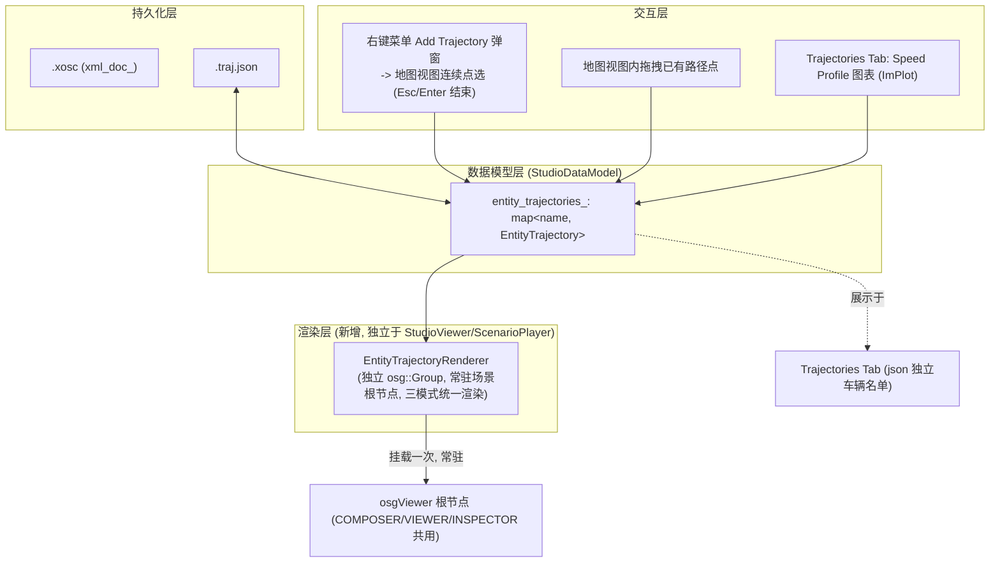

# 轨迹编辑功能开发方案（路径 Path + Speed Profile）

本方案面向 Scenario Studio 的新需求：为场景中的每个 Entity 增加独立于 OpenSCENARIO XML 的**路径（Path）**与**距离-速度曲线（Speed Profile）**编辑能力，并配套新增 `.traj.json` 侧车文件（sidecar file）与独立于 `viewer::StudioViewer` / `ScenarioPlayer` 的渲染管线。文中涉及现有实现的引用均标注文件名与行号，便于核对。

---

## 1. 背景与目标

- 现状：场景的唯一数据源是 [StudioDataModel.hpp](EnvironmentSimulator/Modules/StudioViewerBase/StudioDataModel.hpp#L159) 中的 `xml_doc_`（`pugi::xml_document`），Entity 的初始位置/速度只以 `Storyboard/Init/Actions/Private` 下的 `TeleportAction` + `SpeedAction` 形式存在（参见 [StudioDataModel.cpp](EnvironmentSimulator/Modules/StudioViewerBase/StudioDataModel.cpp#L624-L681) 中 `AddVehicle` 的写法），运动轨迹只有当用户手工在 XML 树中搭出 `FollowTrajectoryAction/Trajectory/Shape/Polyline/Vertex` 结构时才存在，且只能在 COMPOSER（编辑）模式下以静态折线形式显示（[StudioGui.cpp](EnvironmentSimulator/Modules/StudioViewerBase/StudioGui.cpp#L3143-L3175)）。
- 目标：
  1. 新增 `EntityPose` / `EntityPath` / `SpeedProfilePoint` / `EntitySpeedProfile` / `EntityTrajectory` 数据结构，脱离 `xml_doc_` 独立存储每个 Entity 的路径与速度曲线（每个 Entity 至多一条 `EntityTrajectory`，不支持多候选方案）。
  2. 新增同名、扩展名为 `.traj.json` 的文件承载上述轨迹数据，但**不要求**与 `.xosc` 同时保存——两者是两个独立的保存入口（菜单 `Save OpenSCENARIO` 与 `Save Trajectories`），编辑与保存互不干扰，相当于一个两用编辑器。
  3. 不做"打开 `.xosc` 时自动同步初始状态"的机制；`Add Trajectory` 创建的是**全新的、只存在于 `.traj.json` 中的车辆**（不是给 xosc 中已有的实体添加轨迹）：右键地图视图空白处弹出菜单 `Add Trajectory`（弹窗形式，与 `Add Vehicle` 类似）确认后，进入"地图视图连续点选"模式，直到 `Esc`/`Enter` 结束，新车辆与新路径仅写入 `EntityTrajectory`/`.traj.json`，不触碰 `.xosc`。
  4. 编辑（COMPOSER）、预览（VIEWER）、回放（INSPECTOR）三种模式下，路径/速度曲线/车辆位置的渲染、更新、在线编辑，统一由新增的 `EntityTrajectoryRenderer` 负责，不再依赖 `viewer::StudioViewer` 与 `ScenarioPlayer` 的生命周期；由于轨迹数据与仿真引擎完全解耦，不存在"实际仿真位置 vs. 编辑路径"的偏差需要展示。

---

## 2. 现状梳理（问题所在）

### 2.1 数据层：xml_doc_ 是唯一权威来源

`StudioDataModel` 里所有的增删改（`DeleteEntity`/`CloneEntity`/`RenameEntity`/`AddVehicle`，见 [StudioDataModel.hpp:84-86](EnvironmentSimulator/Modules/StudioViewerBase/StudioDataModel.hpp#L84-L86)）都是直接对 `xml_doc_` 的 `pugi::xml_node` 操作，Undo/Redo 也是对 XML 文本做 diff（`undo_stack_`/`redo_stack_`，[StudioDataModel.hpp:141-145](EnvironmentSimulator/Modules/StudioViewerBase/StudioDataModel.hpp#L177-L192)）。轨迹/速度信息独立存储后不再与 `xml_doc_` 联动，仍需要考虑两个独立文件之间的孤儿数据等一致性问题（见第 13 节）；Undo/Redo 本期暂不实现（见第 11 节）。

### 2.2 渲染层：三种模式对场景图的所有权不一致

`main.cpp` 中的模式切换（[main.cpp:263](EnvironmentSimulator/Applications/scenariostudio/main.cpp#L263) COMPOSER、[main.cpp:287](EnvironmentSimulator/Applications/scenariostudio/main.cpp#L287) VIEWER、[main.cpp:388](EnvironmentSimulator/Applications/scenariostudio/main.cpp#L388) INSPECTOR）每次切换模式都会先调用 [`g_viewer->Cleanup()`](EnvironmentSimulator/Applications/scenariostudio/main.cpp#L261)，VIEWER 模式下场景中的 Entity 节点由 `ScenarioPlayer`（`player->RegisterExternalViewer(g_viewer.get())`，[main.cpp](EnvironmentSimulator/Applications/scenariostudio/main.cpp#L316)）接管创建/销毁，INSPECTOR 模式下则由 `replayer::Run`（[main.cpp:397](EnvironmentSimulator/Applications/scenariostudio/main.cpp#L397)）接管。也就是说，当前场景图节点的生命周期分属三套不同的所有者，如果路径/速度曲线的可视化节点直接挂在这些会被清空/重建的 Group 下，就会在模式切换时被销毁或与实际实体渲染逻辑相互干扰。这正是用户要求"新的路径、speed profile 和车辆位置渲染不再依赖 `viewer::StudioViewer` 和 `ScenarioPlayer`"的原因。

### 2.3 现有的 Marker/Trajectory 可视化能力有限

`StudioGui::DrawPositionMarkers`（[StudioGui.cpp:2998](EnvironmentSimulator/Modules/StudioViewerBase/StudioGui.cpp#L2998)）只在 `StudioGui::Render`（[StudioGui.cpp:451](EnvironmentSimulator/Modules/StudioViewerBase/StudioGui.cpp#L451)）里 `mode_ == StudioMode::COMPOSER` 分支被调用（[StudioGui.cpp:486](EnvironmentSimulator/Modules/StudioViewerBase/StudioGui.cpp#L486)），其轨迹折线的绘制是通过遍历 `extracted_positions_`、按其祖先是否为 `Polyline/Clothoid/Nurbs` 节点分组之后连线得到的（[StudioGui.cpp:3143-3175](EnvironmentSimulator/Modules/StudioViewerBase/StudioGui.cpp#L3143-L3175)），本质上是"XML 里已经手写了 Trajectory 结构才能画出来"，无法支持"先在编辑器里画路径、再决定是否写回 XML"的工作流，也完全不在 VIEWER/INSPECTOR 模式下渲染。

---

## 3. 总体架构



设计原则：

1. **数据独立、互不联动**：`EntityTrajectory` 完全独立于 `pugi::xml_node`，`Add Trajectory` 创建的车辆**根本不在 `.xosc` 中声明**，两者是完全独立的两套数据、两套命名空间、两个独立保存入口。
2. **渲染独立、三模式统一**：新增一个不受 `StudioViewer::Cleanup()`、`ScenarioPlayer`、`replayer` 生命周期影响的渲染对象 `EntityTrajectoryRenderer`，一次性挂载到 osg 根节点，COMPOSER/VIEWER/INSPECTOR 三种模式下渲染逻辑完全一致（只是编辑交互仅在 COMPOSER 下开放），不需要与仿真引擎实际运动做比对。
3. **不做导出/烘焙**：本期不实现把 `EntityTrajectory` 转换成 `FollowTrajectoryAction`/`Trajectory` XML 节点的功能；`EntityTrajectory` 对场景仿真运行没有任何影响，纯粹是编辑器侧的可视化与编辑数据（详见第 10 节）。

---

## 4. 数据模型设计（StudioDataModel.hpp 新增类型）

### 4.1 EntityPose：单个路径采样点，双向支持 LanePos / WorldPos

```cpp
// 一个路径采样点：同时保存 WorldPos 与 LanePos 表示，二者通过 PosUtil.hpp
// 中已有的 ConvertWorldPosToLanePos / ConvertLanePosToWorldPos 互相同步。
struct EntityPose
{
    // WorldPos
    double x = 0.0, y = 0.0, z = 0.0, h = 0.0;

    // LanePos
    int    road_id = 0;
    int    lane_id = 0;
    double s = 0.0;
    double lane_offset  = 0.0;
    double relative_h   = 0.0;   // 相对车道方向的朝向

    // 哪一种表示是"这次编辑"的权威来源，避免来回转换的精度漂移
    enum class SourceRepr { WORLD, LANE } source = SourceRepr::WORLD;

    // 由 world -> lane 重新计算 road_id/lane_id/s/lane_offset/relative_h
    void SyncFromWorld(bool align_to_lane = true);
    // 由 lane -> world 重新计算 x/y/z/h
    void SyncFromLane();
};
```

> 复用建议：`SyncFromWorld`/`SyncFromLane` 内部直接调用 [PosUtil.hpp](EnvironmentSimulator/Modules/StudioViewerBase/PosUtil.hpp#L18-L22) 中已经实现好的 `ConvertWorldPosToLanePos` / `ConvertLanePosToWorldPos`（实现见 [PosUtil.cpp:19-64](EnvironmentSimulator/Modules/StudioViewerBase/PosUtil.cpp#L19-L64)），不需要重新封装 `roadmanager::Position` 的调用逻辑。

### 4.2 EntityPath：一条由若干 EntityPose 组成的路径

```cpp
class EntityPath
{
public:
    std::vector<EntityPose> points_;  // 用户可编辑的稀疏控制点

    enum class InterpMode { LINEAR, CATMULL_ROM, CLOTHOID };
    InterpMode interp_mode_ = InterpMode::LINEAR;

    double GetTotalLength() const;                       // 沿 points_ 的弧长
    EntityPose Evaluate(double s) const;                  // 按弧长插值取得任意 s 处的 Pose
    int  InsertPoint(double s, const EntityPose& pose);   // 插入控制点，返回插入下标
    void RemovePoint(int index);
    int  FindNearestPointIndex(double x, double y) const; // 供 3D 拾取使用

    // 生成/刷新等弧长重采样表，供渲染与 s-t 映射使用（见 9.1、9.3 节）
    void RebuildDenseSamples(double ds = 0.5);
    const std::vector<EntityPose>& DenseSamples() const { return dense_samples_; }

private:
    std::vector<EntityPose> dense_samples_;  // 缓存，不入 JSON
};
```

### 4.3 SpeedProfilePoint / EntitySpeedProfile

```cpp
struct SpeedProfilePoint
{
    double s = 0.0;      // 沿 EntityPath 弧长的位置（distance-based）
    double speed = 0.0;  // 该处目标速度 m/s
};

class EntitySpeedProfile
{
public:
    std::vector<SpeedProfilePoint> points_;

    enum class InterpMode { LINEAR, MONOTONIC_CUBIC };
    InterpMode interp_mode_ = InterpMode::LINEAR;

    double EvaluateSpeed(double s) const;      // 给定 s 求速度
    int    InsertPoint(double s, double speed);
    void   RemovePoint(int index);

    // 对 s 做数值积分得到 t(s)，用于 ghost 预览动画（见 9.3 节）
    double EvaluateTimeAtS(double s) const;
    double EvaluateSAtTime(double t) const;    // 反查（二分 + 插值）

private:
    std::vector<double> time_table_;           // 与 points_ 对齐的时间缓存，懒重建
    bool time_table_dirty_ = true;
};
```

### 4.4 EntityTrajectory：绑定 path_ 与 speed_profile_，且与 xosc 完全无关

```cpp
class EntityTrajectory
{
public:
    std::string        entity_name_;   // 仅存在于 .traj.json，不对应任何 xosc ScenarioObject
    EntityPath          path_;
    EntitySpeedProfile  speed_profile_;

    // 只要有 1 个点即可视为有效（1 个点 = 静止的独立标注车辆）
    bool HasPath() const { return !path_.points_.empty(); }
};
```

> `entity_name_` 只需要在 `entity_trajectories_` 内部唯一，但为了避免 UI 上出现"同名两套实体"的困惑，`Add Trajectory` 弹窗的名称校验建议同时排重 xosc 的 `GetScenarioObjectNames()` 与 `entity_trajectories_` 现有 key（见第 6 节）。

### 4.5 StudioDataModel 中新增成员

```cpp
// StudioDataModel.hpp
std::map<std::string, EntityTrajectory> entity_trajectories_;
std::string                             traj_json_path_;               // 由 xosc_path_ 派生
bool                                    trajectories_modified_ = false; // 独立于 modified_ 的脏标记

bool LoadTrajJson(const std::string& path);
bool SaveTrajJson(const std::string& path);

// Add Trajectory 交互：创建一个全新的、只存在于 json 中的车辆条目并返回引用，
// 供 UI 层驱动后续的连续点选；entity_name 需要提前校验唯一性（见第 6 节）
EntityTrajectory& CreateEntityTrajectory(const std::string& entity_name);
void              RemoveEntityTrajectory(const std::string& entity_name);
```

---

## 5. `.traj.json` 持久化设计

### 5.1 文件路径推导

与 `.xosc` 同目录、同主文件名，扩展名替换为 `.traj.json`：例如 `scenario.xosc` → `scenario.traj.json`。建议封装成一个纯函数 `DeriveTrajJsonPath(const std::string& xosc_path)`，供加载/保存/另存为/复制等多处复用（避免各处手写字符串拼接产生不一致）。

### 5.2 JSON Schema 示例

```jsonc
{
  "version": 1,
  "source_xosc": "scenario.xosc",     // 仅作为该轨迹侧车文件的关联说明，不代表 entities 里的名称对应 xosc 中的 ScenarioObject
  "entities": {
    "GhostCar1": {
      "path": {
        "interp_mode": "spline",
        "points": [
          { "x": 10.000, "y": 2.000, "z": 0.000, "h": 0.0000,
            "road_id": 1, "lane_id": -1, "s": 10.000, "lane_offset": 0.000, "relative_h": 0.0000 },
          { "x": 60.000, "y": 2.000, "z": 0.000, "h": 0.0000,
            "road_id": 1, "lane_id": -1, "s": 60.000, "lane_offset": 0.000, "relative_h": 0.0000 }
        ]
      },
      "speed_profile": {
        "interp_mode": "linear",
        "points": [
          { "s": 0.000,  "speed": 13.889 }
        ]
      }
    }
  }
}
```

浮点数统一固定小数位数格式化（如 3~4 位），字段顺序固定、`points` 按 `s`/顺序存储，避免每次保存都产生大量无意义的 git diff（详见第 13 节）。`entities` 下的 key（例如 `GhostCar1`）是 `Add Trajectory` 弹窗里用户填写的名称，与 `.xosc` 的 `Entities/ScenarioObject` 列表**没有任何对应关系**，即使恰好同名也只是巧合（弹窗会做跨命名空间的重名校验，见第 6 节）。

### 5.3 JSON 库选型（已确定）

仓库当前没有 JSON 依赖（已检索 `nlohmann` 关键字无结果，`CMakeLists.txt` 中也没有 json 相关三方库）。**已确定使用 `nlohmann/json`**（header-only，MIT 协议），vendor 到 `externals/json/`，参照仓库现有第三方库（`externals/pugixml` 等）的接入方式，并在 `3rd_party_terms_and_licenses/` 下补充其许可证文件。

### 5.4 Load/Save 集成点（两个入口完全独立）

- `LoadXoscXml`（[StudioDataModel.cpp:309-324](EnvironmentSimulator/Modules/StudioViewerBase/StudioDataModel.cpp#L309-L324)）成功后：只计算 `traj_json_path_` 并在同目录存在同名 `.traj.json` 时调用 `LoadTrajJson` 加载已有轨迹数据；`entity_trajectories_` 里的条目与 xosc 的 `ScenarioObject` 列表**没有归属关系**，加载时不做任何比对/生成。
- 菜单新增两个独立入口：
  - `Save OpenSCENARIO`：只调用现有 `SaveXoscXml`，清除 `modified_`。
  - `Save Trajectories`：只调用 `SaveTrajJson(traj_json_path_)`，清除新增的 `trajectories_modified_`。
  两者互不触发对方，允许用户只保存其中一个文件；退出程序、切换场景文件时，若 `modified_ || trajectories_modified_` 为 true，弹出**一个合并的**确认框（例如"OpenSCENARIO 和/或 Trajectories 存在未保存的更改，是否保存？"），不需要分别弹两次（见第 13 节）。
- `AddVehicle`（[StudioDataModel.cpp:624-681](EnvironmentSimulator/Modules/StudioViewerBase/StudioDataModel.cpp#L624-L681)，创建 xosc 里的真实 `ScenarioObject`）与 `CreateEntityTrajectory`（创建 json 里的独立车辆）是两个完全独立、互不调用的入口，分别对应 `Save OpenSCENARIO`/`Save Trajectories` 两套数据。

---

## 6. 新增轨迹的创建方式：`Add Trajectory` 交互

`Add Trajectory` **不是**给 xosc 中已有的实体附加轨迹，而是**新建一个只存在于 `.traj.json` 中的独立车辆**（含名称、路径、Speed Profile），与现有 `Add Vehicle`（新建 xosc `ScenarioObject`）是两个平行但完全独立的命令。

### 6.1 交互流程

1. 用户在地图视图空白处右键，复用现有 `HandleViewportContextMenu`（[StudioGui.cpp:1280-1294](EnvironmentSimulator/Modules/StudioViewerBase/StudioGui.cpp#L1280-L1294)）弹出的 "Viewport Context Menu"，在其中新增 `Add Trajectory` 菜单项（与 `Add Vehicle` 并列）。
2. 点击后弹出模态窗口 `Add Trajectory`——**不直接复用** `OpenAddVehicleDialog`/`HandleAddVehicleDialog`（[StudioGui.cpp:1298-1362](EnvironmentSimulator/Modules/StudioViewerBase/StudioGui.cpp#L1298-L1362)）这两个函数，而是新增一套结构类似、但完全独立实现的 `OpenAddTrajectoryDialog`/`HandleAddTrajectoryDialog`（两者数据模型、校验规则不同，独立实现更清晰、也避免相互影响）。弹窗包含字段：
   - **Name**：车辆名称，校验非空且唯一——同时排重 xosc 的 `GetScenarioObjectNames()` 与 `entity_trajectories_` 现有 key（校验逻辑参考 [StudioGui.cpp:1349-1353](EnvironmentSimulator/Modules/StudioViewerBase/StudioGui.cpp#L1349-L1353) 的判重写法重新实现一份，而不是调用同一个函数）。
   - **Init Speed (m/s)**：数值输入，confirm 后直接作为 `speed_profile_.points_ = { {s=0, speed=init_speed} }` 的唯一初始点，与 `.xosc` 完全无关（这个车辆本来就不在 xosc 里，没有 `SpeedAction` 可言）。
   - **Path Interpolation**：下拉框 `Linear` / `Spline` / `Clothoid`，分别对应 `EntityPath::InterpMode::LINEAR/CATMULL_ROM/CLOTHOID`，**默认选中 `Spline`**。
   - Confirm/Cancel 按钮，`Enter`（在可确认状态下）等价于 Confirm，`Esc` 等价于 Cancel——这一步的 `Esc`/`Enter` 是弹窗本身的确认/取消，与第 3 步"连续点选"阶段的 `Esc`/`Enter` 含义不同，需要在实现里明确区分两个阶段。
3. Confirm 后关闭弹窗，调用 `CreateEntityTrajectory(name)` 生成一个空的 `EntityTrajectory`（`path_.points_` 为空、`interp_mode_` 按选择设置、`speed_profile_` 按上一步设置），随后进入"连续点选"模式：
   - 每次左键点击地图视图，取鼠标世界坐标转换为 `EntityPose`（调用 `SyncFromWorld`），`push_back` 到 `path_.points_`。
   - 点选过程中，`EntityTrajectoryRenderer` 实时绘制"已确认点连线 + 最后一个点到当前鼠标位置的橡皮筋预览线"，可参考现有 `heading_operation_active_`/`heading_preview_h_` 一类"操作进行中"状态机与橡皮筋线绘制的先例（[StudioGui.cpp:3183-3193](EnvironmentSimulator/Modules/StudioViewerBase/StudioGui.cpp#L3183-L3193)）。
   - **`Enter`**：结束点选，视为"轨迹添加完成"——把当前已经点选的所有点（至少 1 个）连同名称、Speed Profile 一起提交到 `entity_trajectories_[name]`，置位 `trajectories_modified_ = true`。若此时一个点都还没点选（`path_.points_` 为空），`Enter` **直接忽略**（不提交、不退出点选模式，也不做任何提示，等待用户继续点选或按 `Esc` 取消）。
   - **`Esc`**：撤销"上一个"已点选的点（`path_.points_.pop_back()`）；若当前**没有**任何已点选的点（刚进入点选模式、或已经把所有点都撤销完），则 `Esc` 表示放弃本次新增，销毁刚才 `CreateEntityTrajectory` 创建的临时条目，退出点选模式，不写入 `.traj.json`。
4. 全程都不会创建、修改 `.xosc` 中的任何节点——这个新车辆和它的轨迹只存在于 `entity_trajectories_`/`.traj.json`。

### 6.2 与现有交互状态机的整合

现有 `StudioGui` 已经有若干"进行中操作"的状态标记（如 `heading_operation_active_`、`pending_move_count_`），建议把 `Add Trajectory` 的连续点选、以及第 7.4 节的路径点拖拽都纳入同一个互斥的"当前交互模式"状态（例如一个 `enum class ActiveInteraction { NONE, HEADING_EDIT, MOVE, TRAJECTORY_PICKING, PATH_POINT_DRAG }` 之类的单一状态变量），避免多个交互模式同时激活导致鼠标事件冲突。

### 6.3 已有路径的后续编辑

一旦路径创建完成，后续编辑**只能通过在地图视图中直接拖拽已有路径点**完成（不提供数值输入框编辑坐标），拖拽逻辑与第 7.4 节描述一致。**本期不做**"插入/删除中间点"的手势，路径点数量在 `Add Trajectory` 完成后即固定，后续如需增删点，只能删除整条轨迹后用 `Add Trajectory` 重新绘制（插入/删除中间点作为后续迭代的功能）。删除整条轨迹通过 `RemoveEntityTrajectory` 完成，入口建议放在 `Trajectories` Tab 每一行的 `Delete` 按钮（见第 8.2 节）。

---

## 7. 渲染架构方案（脱离 StudioViewer / ScenarioPlayer）

### 7.1 新增独立渲染类 `EntityTrajectoryRenderer`

建议新增文件 `EnvironmentSimulator/Modules/StudioViewerBase/TrajectoryRenderer.hpp/.cpp`：

```cpp
class EntityTrajectoryRenderer
{
public:
    // 在应用启动时调用一次，把 root_ 挂到 osg 场景的顶层节点（例如
    // g_viewer->osgViewer_->getSceneData() 的兄弟节点，或专门新增一个
    // "Overlay" Group，与 StudioViewer/ScenarioPlayer/replayer 各自管理
    // 的 Group 平级，不受它们各自 Cleanup 逻辑影响）。
    void Init(osg::Group* scene_root);

    // 每帧调用；根据 mode 决定渲染细节（见 7.2）
    void Update(const StudioDataModel& model, StudioMode mode, float virtual_time);

    // 增量刷新：仅在某个 entity 的 path/speed_profile 被编辑时调用，
    // 避免每帧全量重建 osg 节点（性能考虑，见 13 节）
    void MarkDirty(const std::string& entity_name);

private:
    osg::ref_ptr<osg::Group> root_;
    std::map<std::string, osg::ref_ptr<osg::Group>> per_entity_groups_;
};
```

关键点：`root_` 只在程序启动时创建、挂载一次，三种模式共用同一个实例，不随 `g_viewer->Cleanup()`（[main.cpp:261](EnvironmentSimulator/Applications/scenariostudio/main.cpp#L261)）、`ScenarioPlayer`（[main.cpp:316](EnvironmentSimulator/Applications/scenariostudio/main.cpp#L316)）或 `replayer::Run`（[main.cpp:397](EnvironmentSimulator/Applications/scenariostudio/main.cpp#L397)）的生命周期被清理。

### 7.2 三种模式下的渲染内容差异

| 模式 | 路径线 | 路径顶点 marker | 速度曲线 | 车辆代理 marker（ghost） |
|---|---|---|---|---|
| COMPOSER（编辑） | 实线绘制 | 可拾取/拖拽（编辑已有点） | `Trajectories` Tab 内可编辑 | 按 `virtual_time_` 通过 `EvaluateSAtTime` 换算 s，再 `EntityPath::Evaluate(s)` 摆放 ghost marker |
| VIEWER（预览，由 ScenarioPlayer 驱动） | 与 COMPOSER 一致的实线绘制 | 只读，不可拖拽 | `Trajectories` Tab 内只读展示 | 同 COMPOSER，独立于 `ScenarioPlayer` 渲染的真实实体运行 |
| INSPECTOR（回放 .rec） | 同上 | 只读 | 只读 | 同上 |

由于 `EntityTrajectory` 与仿真引擎完全解耦（不烘焙为 `FollowTrajectoryAction`，见第 10 节），三种模式下 `EntityTrajectoryRenderer` 的渲染内容和视觉表现完全一致，**不需要**"参考路径 vs. 实际仿真轨迹偏差高亮"之类的对比功能——路径/ghost marker 只是编辑器侧的独立标注图层，与 `ScenarioPlayer`/`replayer` 各自渲染的真实实体互不影响、叠加显示即可。`Add Trajectory` 创建的车辆虽然不对应任何 xosc `ScenarioObject`/`CatalogReference`，但 ghost marker 渲染时使用一个**固定的默认车辆模型**：直接引用 `resources/xosc/Catalogs/Vehicles/VehicleCatalog.xosc` 中的一个默认条目（例如 `car_white`，`model3d="../models/car_white.osgb"`），用其 OSGB 文件渲染，而不是纯色占位符方框。实现上不能直接调用 `GetOSGBModelForScenarioObject`（[StudioGui.cpp:3292](EnvironmentSimulator/Modules/StudioViewerBase/StudioGui.cpp#L3292)），因为该函数依赖 `temp_entities_->GetObjectByName()` 解析出的、来自 xosc 的 `scenarioengine::Object`，而 json 车辆没有对应对象；建议新增一个独立的小函数（例如 `LoadDefaultTrajectoryVehicleModel()`），直接解析 `VehicleCatalog.xosc` 里固定条目的 `model3d` 属性得到 osgb 文件名，复用 [StudioGui.cpp:3320-3336](EnvironmentSimulator/Modules/StudioViewerBase/StudioGui.cpp#L3320-L3336) 里同一套"多候选路径"解析逻辑加载模型，全局缓存一次后被所有 json 车辆的 ghost marker 共用（类似 `DrawPositionMarkers` 里 `blue_box_node` 等共享节点在多个 marker 间复用的方式）。这也不再需要 [main.cpp:352-354](EnvironmentSimulator/Applications/scenariostudio/main.cpp#L352-L354) 里模式切换时对 `markers_to_update_` 的依赖，新方案改用 `MarkDirty`/脏区域更新触发重绘。

### 7.3 主循环整合点

**实现时的简化**：`StudioGui::Render(osg::RenderInfo&)` 是通过 `camera->addPostDrawCallback(new ImGuiRenderCallback(*this))`（在 `StudioGui::handle()` 里注册一次）挂到 `osgViewer_` 的相机上的，而 COMPOSER/VIEWER/INSPECTOR 三种模式共用同一个 `g_viewer`/`osgViewer_` 实例（VIEWER 模式下 `ScenarioPlayer` 通过 `RegisterExternalViewer` 复用它、INSPECTOR 模式下 `replayer::Run` 同样复用它），所以 `Render()` 本身在三种模式下每帧都会被调用——不需要像最初设想的那样去改 `main.cpp` 里三个模式各自的帧循环。实际实现是在 `StudioGui::Render()` 内、`UpdateMousePositionFromWorld()` 之后无条件调用一次 `trajectory_renderer_.Update(data_model_, data_model_.mode_, data_model_.virtual_time_)`，效果与本节最初的方案一致（三种模式每帧都执行），但改动面更小、风险更低。

### 7.4 拾取与交互

3D 拾取复用现有鼠标世界坐标机制（`hud_mouse_world_x_/hud_mouse_world_y_`，`StudioGui.cpp` 中已有 `UpdateMousePositionFromWorld`）与 `TopViewManipulator`（[TopViewManipulator.hpp](EnvironmentSimulator/Modules/StudioViewerBase/TopViewManipulator.hpp)）已提供的鼠标->世界坐标转换，在其基础上扩展：命中路径顶点 marker 时进入"拖拽路径点"模式（类似现有 `StartMoveOperation`/`heading_operation_active_` 的模式化交互设计），松开鼠标后调用 `EntityPose::SyncFromWorld()` 更新 lane 坐标，并 `renderer.MarkDirty(entity_name)`。该交互与第 6.2 节的 `Add Trajectory` 连续点选共用同一个互斥交互状态机，避免二者同时被触发。

---

## 8. 右侧面板改造：`XML Tree` / `Trajectories` 双 Tab

原右侧 XML 树面板（`RenderXmlTree`，[StudioGui.cpp:496](EnvironmentSimulator/Modules/StudioViewerBase/StudioGui.cpp#L496)）改为两个 Tab：

### 8.1 `XML Tree` Tab

原有功能不变，仍是通用的 XML 节点树编辑器。

### 8.2 `Trajectories` Tab（新增）

只列出通过 `Add Trajectory` 创建的、**只存在于 `entity_trajectories_`/`.traj.json` 中的独立车辆**（不是 xosc 的 `ScenarioObject`，暂不支持行人/非机动车，见第 6 节）。每个条目展示：

- **初始位置**：直接取 `path_.points_.front()`（即路径的第一个点），只读文本显示（如 `x=10.0, y=2.0, road 1 lane -1 s=10.0`），编辑只能通过第 7.4 节描述的地图视图拖拽该点完成。
- **初始速度**：直接取 `speed_profile_.points_.front().speed`（Speed Profile 的第一个速度点），与 `.xosc` 完全无关；可在下方的 Speed Profile 图表中拖拽第一个点进行编辑。
- **路径（Path）**：只展示点数与总弧长摘要（例如 `12 points, 84.3 m`），不展开逐点坐标列表；提供 `Delete` 按钮（调用 `RemoveEntityTrajectory`，整条删除后可用 `Add Trajectory` 重新绘制）。
- **Speed Profile**：完整的可编辑 2D 图表。仓库 `3rd_party_terms_and_licenses/implot_LICENSE.txt` 表明项目已引入 **ImPlot**，可直接复用：
  - X 轴为沿路径弧长 `s`（范围 `[0, EntityPath::GetTotalLength()]`），Y 轴为速度；
  - 用 `ImPlot::DragPoint` 支持对 `SpeedProfilePoint` 的拖拽编辑（含第一个点，即"初始速度"）；右键菜单支持插入/删除点；
  - 3D 视图中选中某个路径顶点时，在图表中用竖直参考线高亮该顶点对应的 `s`，两者联动。

---

## 9. 路径与速度曲线的计算方法建议

### 9.1 路径插值方式比较

| 方式 | 说明 | 适用场景 |
|---|---|---|
| 分段线性 Polyline | 控制点之间直线连接 | 与 OpenSCENARIO 原生 `Polyline` 语义完全一致，实现最简单，适合作为默认模式与导出格式 |
| Catmull-Rom / 三次样条 | 控制点少时也能获得平滑曲线，编辑手感好 | 编辑态预览；曲率不连续（二阶不连续），不适合直接作为最终车辆动力学输入 |
| Clothoid / ClothoidSpline | 曲率连续变化，符合真实车辆转向的物理特性 | 精度要求高、需要导出为 OSC `ClothoidSpline` 的场景；仓库 `RoadManager.hpp` 中已有 `ClothoidShape`/`PolyLineBase`（`EnvironmentSimulator/Modules/RoadManager/RoadManager.hpp:4285` 起、`4450` 起）等基础设施可直接复用，避免重复实现曲率计算与采样逻辑 |

**建议的分层策略**：`EntityPath::points_` 保存用户可编辑的稀疏控制点（数量少，便于拖拽交互），`interp_mode_` 决定控制点之间如何插值；`RebuildDenseSamples(ds)` 按固定弧长间隔（如 0.5m）生成 `dense_samples_` 缓存表，供渲染折线、速度曲线 s 轴对齐使用。三种插值模式可以共用同一套 dense sample 消费方；只有 `RebuildDenseSamples` 内部实现不同。`Add Trajectory` 弹窗（第 6.1 节）里 `Path Interpolation` 下拉框**默认选中 `Spline`**（即 `CATMULL_ROM`），`Linear`/`Clothoid` 为可选项，与是否导出 OSC 无关（本期不做导出，见第 10 节）。

### 9.2 Speed Profile 计算方式比较

| 方式 | 说明 |
|---|---|
| 分段线性（默认） | 与 `SpeedProfilePoint(s, speed)` 的定义直接对应，最简单、可预测 |
| 单调三次插值（Monotonic Cubic / Fritsch–Carlson） | 避免线性插值在转折点处的加速度阶跃，运动更平滑，同时保证不会因为三次样条的"超调"在两点之间产生速度大于两端点的错误现象 |
| 限幅平滑（可选后处理） | 给定最大加速度/减速度约束，对用户编辑后的曲线做梯形/S 型（jerk-limited）速度曲线平滑，用于生成更接近真实车辆动力学的 ghost 预览动画，而不改变用户编辑的原始控制点 |

建议默认提供**分段线性**（实现简单、用户可预期），并将**单调三次插值**与**限幅平滑**作为 `EntitySpeedProfile::InterpMode` 的可选项，由用户在 UI 上选择。

### 9.3 s-t 参数化（供 ghost 动画 / 回放对比使用）

编辑模式下需要一个"沿路径按编辑速度运动"的车辆代理动画（ghost marker，见 7.2 节），核心是要建立 `s <-> t` 的映射：

$$t(s) = \int_0^s \frac{1}{v(s')}\,ds'$$

实现建议：

1. 在 `EntitySpeedProfile::RebuildDenseSamples`（或专门的 `EvaluateTimeAtS`）中，对 `points_`（或 dense 采样）做梯形数值积分，缓存 `time_table_`（与 s 对齐的一张查找表），标记为懒重建（`time_table_dirty_`），只有在速度曲线被编辑后才重建，避免每帧重算。
2. 给定 `virtual_time_`，通过对 `time_table_` 二分查找 + 线性插值得到对应的 `s`（`EvaluateSAtTime`），再用 `EntityPath::Evaluate(s)` 得到 `EntityPose`，用于摆放 COMPOSER 模式下的 ghost marker。
3. 注意速度为 0 的路段会导致 $1/v$ 发散，需要特殊处理（例如钳制最小速度 epsilon，或将静止路段的时间增量按"匀加速到下一个非零速度点"处理）。

### 9.4 与现有 RoadManager 能力的复用

`roadmanager::PolyLineBase`/`Shape`/`ClothoidShape`（`RoadManager.hpp:4285` 起）已经实现了路径采样、弧长计算、按 s 查询等能力，`EntityPath` 的 dense 采样与弧长计算建议直接复用这套基础设施封装的算法，而不是重新实现一遍数值积分/插值代码，降低维护成本。（由于本期不做导出/烘焙，此处复用纯粹是为了减少工作量，不涉及与仿真引擎采样行为的一致性问题。）

---

## 10. 与现有 OpenSCENARIO 动作的关系（本期不做导出/烘焙）

`EntityTrajectory` 定位为**纯编辑器侧的辅助数据**，本期**明确不实现**把它转换成 xosc 中 `FollowTrajectoryAction`/`Trajectory`/`Polyline`/`Vertex` 结构的"烘焙导出"功能：

- `EntityTrajectory` 对场景仿真运行（`ScenarioPlayer`/esmini 引擎）没有任何影响，纯粹用于 Scenario Studio 编辑器内的可视化、预览与在线编辑。
- 现有基于 XML 树的 `Polyline`/`Vertex` 手工编辑与可视化通道（[StudioGui.cpp:3143-3175](EnvironmentSimulator/Modules/StudioViewerBase/StudioGui.cpp#L3143-L3175)）保持不变，与新的 `EntityTrajectory`/`EntityTrajectoryRenderer` 是两套完全独立、互不感知的系统：前者只在 COMPOSER 模式下、且只有用户手写了对应 XML 结构时才会画出来；后者由 `.traj.json` 驱动、三种模式下始终渲染。两者叠加显示不会冲突，但也不会互相同步或转换。
- 若未来需要"烘焙导出"，应作为独立的后续需求单独评估（涉及如何映射 `TrajectoryFollowingMode`、`TimeReference` 等当前数据结构未覆盖的语义细节），本方案不预留特定接口。
- 再次强调：`Add Trajectory` 创建的车辆**从未在 `.xosc` 中出现过**（不是先有 xosc 实体、再补一条轨迹），所以也不存在"这个车辆的轨迹要不要写回 xosc"的问题——它自始至终只是 `.traj.json` 里的一条独立记录。

---

## 11. Undo/Redo：仅规划，暂不实现

现状：`StudioDataModel` 现有的撤销/重做机制只针对 `xml_doc_` 的文本 diff（`DiffChunk`，[XmlUtil.hpp:22-29](EnvironmentSimulator/Modules/StudioViewerBase/XmlUtil.hpp#L22-L29)），`undo_stack_`/`redo_stack_` 保存 diff 序列（[StudioDataModel.hpp:177-181](EnvironmentSimulator/Modules/StudioViewerBase/StudioDataModel.hpp#L177-L181)），由 `PushUndoState` 触发。

由于本方案中 `EntityTrajectory` 与 `xml_doc_` **完全解耦**（不做自动同步、不做烘焙），二者不需要打包成同一个撤销单元，实现上比"xml/traj 快照打包"的方案简单得多——理论上只需要给 `entity_trajectories_` 单独维护一套 undo/redo 栈（例如对每次点选/拖拽提交前后做一次深拷贝快照，而不需要像 XML 那样做文本 diff，因为轨迹数据量通常远小于整份 XML 文档）。

**当前决定**：本期只在文档中记录该方案，**不实施**轨迹相关的 Undo/Redo。理由：轨迹编辑、预览、在线编辑等核心功能尚未跑通，过早引入撤销机制容易在数据结构频繁调整时返工。待用户确认路径/速度曲线的编辑、预览、在线编辑功能都稳定完善后，再评估是否实现独立的轨迹 Undo/Redo（见第 14 节路线图，已从里程碑中移出，列为后续可选项）。

---

## 12. 命名管理（与 xosc 实体互相独立）

`entity_trajectories_` 是一个完全独立于 xosc `Entities` 的命名空间，`Add Trajectory` 创建的车辆**不受** `RenameEntity`/`CloneEntity`/`DeleteEntity`（这些函数只操作 xosc 的 `ScenarioObject`，见 [StudioDataModel.hpp:84-86](EnvironmentSimulator/Modules/StudioViewerBase/StudioDataModel.hpp#L84-L86)）影响，二者之间不需要任何生命周期同步钩子。需要处理的只有：

- **创建时的跨命名空间查重**：`Add Trajectory` 弹窗的 `Name` 字段校验需要同时排重 `data_model_.GetScenarioObjectNames()`（xosc 侧）与 `entity_trajectories_` 现有 key（json 侧），避免地图视图里同时出现两个同名对象造成困惑（详见第 6.1 节）；即使技术上两者互不冲突，仍建议禁止重名以保证 UI 清晰。
- **删除**：`Trajectories` Tab 每行提供 `Delete` 按钮，调用 `RemoveEntityTrajectory(entity_name)`，只影响 `entity_trajectories_`/`.traj.json`，与 xosc 无关。
- 本期不提供对 `entity_trajectories_` 条目的"重命名"功能（如需重命名，删除后用 `Add Trajectory` 重新创建），避免过度设计。

---

## 13. 潜在问题清单与应对方案

| 问题 | 说明 | 应对方案 |
|---|---|---|
| json 侧车辆名称与 xosc 实体同名造成困惑 | `entity_trajectories_` 与 xosc `ScenarioObject` 是两个独立命名空间，技术上允许同名，但会在地图视图里造成两个同名对象的视觉混淆 | `Add Trajectory` 弹窗校验名称时同时排重两个命名空间（第 12 节） |
| 两个独立保存入口容易被遗忘 | `Save OpenSCENARIO` 与 `Save Trajectories` 互不触发，用户可能只保存了一个 | 分别维护 `modified_`（已存在）与新增的 `trajectories_modified_` 两个脏标记；退出程序/切换场景时若任一为 true，弹出**一个合并的**确认框提示未保存，不分别弹两次（见 5.4 节） |
| `Add Trajectory` 连续点选与其他交互模式冲突 | 现有 `heading_operation_active_`/`pending_move_count_` 等交互状态若与新的路径点选同时触发，会导致鼠标事件互相干扰 | 见第 6.2 节：所有"进行中操作"归并到同一个互斥的交互状态机，任意时刻只允许一种交互模式激活 |
| 弹窗本身的 `Esc`/`Enter` 与点选阶段的 `Esc`/`Enter` 含义不同、容易混淆 | 弹窗里 `Esc`=Cancel、`Enter`=Confirm（与 `Add Vehicle` 一致）；进入点选后 `Esc`=撤销上一个点/无点时整体取消，`Enter`=完成提交 | 实现上用两个明确不同的阶段状态（弹窗态 vs. 连续点选态）区分按键处理逻辑，避免同一帧内误触发两套逻辑 |
| 大量路径点/多个 Entity 时的渲染性能 | 每帧全量重建 osg 节点会造成卡顿 | `EntityTrajectoryRenderer` 采用脏标记（`MarkDirty(entity_name)`），只重建被编辑过的 Entity 对应子树 |
| WorldPos ↔ LanePos 反复转换的精度/多解问题 | 在多车道汇合、匝道等 junction 附近，`ConvertWorldPosToLanePos`（[PosUtil.cpp:19-40](EnvironmentSimulator/Modules/StudioViewerBase/PosUtil.cpp#L19-L40)）基于 `GetProbeInfo` 可能在相近位置解出不同的 `road_id`/`lane_id` | ①`EntityPose` 增加 `SourceRepr` 标记，优先信任用户刚编辑的表示；②对连续路径点转换时把上一个点的 `road_id`/`lane_id` 作为 hint 传入，优先选择与前一点连续的车道；③ UI 上高亮车道号跳变的路径段 |
| 路径创建后不支持撤销 | 第 11 节决定暂不实现轨迹 Undo/Redo | `Add Trajectory` 的连续点选阶段允许 `Esc` 逐点撤销（无点可撤时整体取消），一旦 `Enter` 提交后，误操作需要用户手动删除/重新拖拽调整，暂无一键撤销，需要在 UI 上有醒目提示 |
| 速度为 0 或负值导致 s-t 积分发散/非法 | 见 9.3 节 | 钳制最小速度 / 特殊处理静止路段 |

---

## 14. 分阶段开发路线图

1. **M1 数据结构与序列化**：在 `StudioDataModel.hpp/.cpp` 中新增 `EntityPose`/`EntityPath`/`SpeedProfilePoint`/`EntitySpeedProfile`/`EntityTrajectory`；vendor `nlohmann/json`；实现 `LoadTrajJson`/`SaveTrajJson` 的纯序列化逻辑（暂不接入主流程）。
2. **M2 `Add Trajectory` 交互**：地图视图右键菜单 + 弹窗（Name/Init Speed/Path Interpolation 默认 Spline，名称跨命名空间校验）+ 地图视图连续点选（`Esc` 逐点撤销/无点时取消，`Enter` 完成提交），提交后写入 `entity_trajectories_`；接入统一交互状态机（第 6.2 节）。
3. **M3 独立渲染层**：实现 `EntityTrajectoryRenderer`，路径折线 + 顶点 marker，COMPOSER/VIEWER/INSPECTOR 三模式统一渲染（无偏差对比）。
4. **M4 右侧面板改造**：`XML Tree`/`Trajectories` 双 Tab；`Trajectories` Tab 内列出所有 json 独立车辆，展示初始位置（path 第一个点）/初始速度（speed profile 第一个点）+ 路径点数摘要 + Speed Profile 编辑图表（ImPlot）+ `Delete` 按钮。
5. **M5 路径点拖拽编辑**：地图视图内直接拖拽已有路径点（第 7.4 节），不支持中途插入/删除点（第 6.3 节已定稿，留待后续迭代）。
6. **M6 Ghost 动画预览**：实现 9.3 节 s-t 映射与 ghost marker 动画，三模式下都可"播放"编辑后的轨迹。
7. **M7 两个保存入口 + 生命周期同步 + 收尾**：接入 `Save OpenSCENARIO`/`Save Trajectories` 独立菜单与脏标记提示；补充 `RenameEntity`/`CloneEntity`/`DeleteEntity` 的 `entity_trajectories_` 同步（第 12 节）；补充单元测试覆盖 path/speed 曲线计算与 JSON 序列化往返一致性。

> Undo/Redo（第 11 节）不在上述里程碑中，作为后续可选项，等核心编辑/预览/在线编辑功能稳定后再评估是否实现。

---

## 15. 实现要点小结（均已定稿）

以下三点是最后确认的实现细节，均已采纳并写入前面各节，不再是开放性问题：

1. **入口方式**：`Add Trajectory` 复用 `HandleViewportContextMenu`（[StudioGui.cpp:1280-1294](EnvironmentSimulator/Modules/StudioViewerBase/StudioGui.cpp#L1280-L1294)）的 "Viewport Context Menu"，在地图视图空白处右键弹出，与特定 Entity 无关（第 6.1 节）。
2. **弹窗与逻辑独立实现**：`OpenAddTrajectoryDialog`/`HandleAddTrajectoryDialog` 是与 `OpenAddVehicleDialog`/`HandleAddVehicleDialog` 结构类似但完全独立的新代码，不直接复用/调用后者的函数（第 6.1 节）。
3. **`Enter` 在 0 点时的行为**：直接忽略，不提交、不退出点选模式、不做提示（第 6.1 节）。
4. **ghost marker 样式**：使用固定默认 `CatalogReference`（`resources/xosc/Catalogs/Vehicles/VehicleCatalog.xosc` 中的默认条目，例如 `car_white`），以其 OSGB 模型渲染，而不是纯色占位符（第 7.2 节）。
