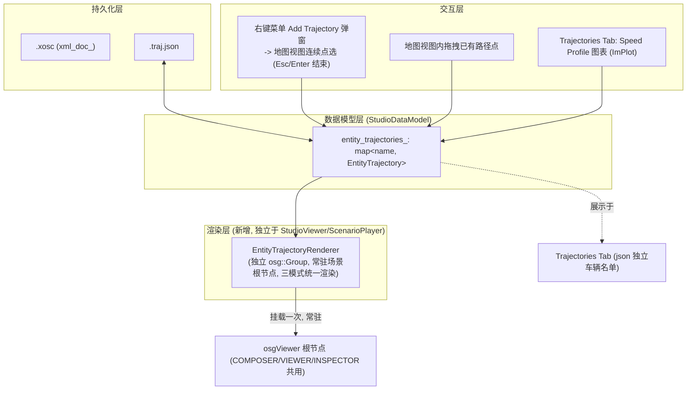

# 轨迹编辑功能开发方案（路径 Path + Speed Profile）

本方案面向 Scenario Studio 的新需求：为场景中的每个 Entity 增加独立于 OpenSCENARIO XML 的**路径（Path）**与**距离-速度曲线（Speed Profile）**编辑能力，并配套新增 `.traj.json` 侧车文件（sidecar file）与独立于 `viewer::StudioViewer` / `ScenarioPlayer` 的渲染管线。文中涉及现有实现的引用均标注文件名与行号，便于核对。

---

## 1. 背景与目标

- 现状：场景的唯一数据源是 [StudioDataModel.hpp](EnvironmentSimulator/Modules/StudioViewerBase/StudioDataModel.hpp#L159) 中的 `xml_doc_`（`pugi::xml_document`），Entity 的初始位置/速度只以 `Storyboard/Init/Actions/Private` 下的 `TeleportAction` + `SpeedAction` 形式存在（参见 [StudioDataModel.cpp](EnvironmentSimulator/Modules/StudioViewerBase/StudioDataModel.cpp#L624-L681) 中 `AddVehicle` 的写法），运动轨迹只有当用户手工在 XML 树中搭出 `FollowTrajectoryAction/Trajectory/Shape/Polyline/Vertex` 结构时才存在，且只能在 COMPOSER（编辑）模式下以静态折线形式显示（[StudioGui.cpp](EnvironmentSimulator/Modules/StudioViewerBase/StudioGui.cpp#L3143-L3175)）。
- 目标：
  1. 新增 `EntityPose` / `EntityPath` / `SpeedProfilePoint` / `EntitySpeedProfile` / `EntityTrajectory` 数据结构，脱离 `xml_doc_` 独立存储每个 Entity 的路径与速度曲线（每个 Entity 至多一条 `EntityTrajectory`，不支持多候选方案）。
  2. 新增同名、扩展名为 `.traj.json` 的文件承载上述轨迹数据，但**不要求**与 `.xosc` 同时保存——两者是两个独立的保存入口（菜单 `Save OpenSCENARIO` 与 `Save Trajectories`），编辑与保存互不干扰，相当于一个两用编辑器。
  3. 不做"打开 `.xosc` 时自动同步初始状态"的机制；`Add Trajectory` 创建的是**全新的、只存在于 `.traj.json` 中的车辆**（不是给 xosc 中已有的实体添加轨迹）：右键地图视图空白处弹出菜单 `Add Trajectory`（弹窗形式，与 `Add Vehicle` 类似）确认后，进入"地图视图连续点选"模式，直到 `Esc`/`Enter` 结束，新车辆与新路径仅写入 `EntityTrajectory`/`.traj.json`，不触碰 `.xosc`。
  4. 编辑（COMPOSER）、预览（VIEWER）、回放（INSPECTOR）三种模式下，路径/速度曲线/车辆位置的渲染、更新、在线编辑，统一由新增的 `EntityTrajectoryRenderer` 负责，不再依赖 `viewer::StudioViewer` 与 `ScenarioPlayer` 的生命周期；由于轨迹数据与仿真引擎完全解耦，不存在"实际仿真位置 vs. 编辑路径"的偏差需要展示。

---

## 2. 现状梳理（问题所在）

### 2.1 数据层：xml_doc_ 是唯一权威来源

`StudioDataModel` 里所有的增删改（`DeleteEntity`/`CloneEntity`/`RenameEntity`/`AddVehicle`，见 [StudioDataModel.hpp:84-86](EnvironmentSimulator/Modules/StudioViewerBase/StudioDataModel.hpp#L84-L86)）都是直接对 `xml_doc_` 的 `pugi::xml_node` 操作，Undo/Redo 也是对 XML 文本做 diff（`undo_stack_`/`redo_stack_`，[StudioDataModel.hpp:141-145](EnvironmentSimulator/Modules/StudioViewerBase/StudioDataModel.hpp#L177-L192)）。轨迹/速度信息独立存储后不再与 `xml_doc_` 联动，仍需要考虑两个独立文件之间的孤儿数据等一致性问题（见第 13 节）；Undo/Redo 本期暂不实现（见第 11 节）。

### 2.2 渲染层：三种模式对场景图的所有权不一致

`main.cpp` 中的模式切换（[main.cpp:263](EnvironmentSimulator/Applications/scenariostudio/main.cpp#L263) COMPOSER、[main.cpp:287](EnvironmentSimulator/Applications/scenariostudio/main.cpp#L287) VIEWER、[main.cpp:388](EnvironmentSimulator/Applications/scenariostudio/main.cpp#L388) INSPECTOR）每次切换模式都会先调用 [`g_viewer->Cleanup()`](EnvironmentSimulator/Applications/scenariostudio/main.cpp#L261)，VIEWER 模式下场景中的 Entity 节点由 `ScenarioPlayer`（`player->RegisterExternalViewer(g_viewer.get())`，[main.cpp](EnvironmentSimulator/Applications/scenariostudio/main.cpp#L316)）接管创建/销毁，INSPECTOR 模式下则由 `replayer::Run`（[main.cpp:397](EnvironmentSimulator/Applications/scenariostudio/main.cpp#L397)）接管。也就是说，当前场景图节点的生命周期分属三套不同的所有者，如果路径/速度曲线的可视化节点直接挂在这些会被清空/重建的 Group 下，就会在模式切换时被销毁或与实际实体渲染逻辑相互干扰。这正是用户要求"新的路径、speed profile 和车辆位置渲染不再依赖 `viewer::StudioViewer` 和 `ScenarioPlayer`"的原因。

### 2.3 现有的 Marker/Trajectory 可视化能力有限

`StudioGui::DrawPositionMarkers`（[StudioGui.cpp:2998](EnvironmentSimulator/Modules/StudioViewerBase/StudioGui.cpp#L2998)）只在 `StudioGui::Render`（[StudioGui.cpp:451](EnvironmentSimulator/Modules/StudioViewerBase/StudioGui.cpp#L451)）里 `mode_ == StudioMode::COMPOSER` 分支被调用（[StudioGui.cpp:486](EnvironmentSimulator/Modules/StudioViewerBase/StudioGui.cpp#L486)），其轨迹折线的绘制是通过遍历 `extracted_positions_`、按其祖先是否为 `Polyline/Clothoid/Nurbs` 节点分组之后连线得到的（[StudioGui.cpp:3143-3175](EnvironmentSimulator/Modules/StudioViewerBase/StudioGui.cpp#L3143-L3175)），本质上是"XML 里已经手写了 Trajectory 结构才能画出来"，无法支持"先在编辑器里画路径、再决定是否写回 XML"的工作流，也完全不在 VIEWER/INSPECTOR 模式下渲染。

---

## 3. 总体架构



设计原则：

1. **数据独立、互不联动**：`EntityTrajectory` 完全独立于 `pugi::xml_node`，`Add Trajectory` 创建的车辆**根本不在 `.xosc` 中声明**，两者是完全独立的两套数据、两套命名空间、两个独立保存入口。
2. **渲染独立、三模式统一**：新增一个不受 `StudioViewer::Cleanup()`、`ScenarioPlayer`、`replayer` 生命周期影响的渲染对象 `EntityTrajectoryRenderer`，一次性挂载到 osg 根节点，COMPOSER/VIEWER/INSPECTOR 三种模式下渲染逻辑完全一致（只是编辑交互仅在 COMPOSER 下开放），不需要与仿真引擎实际运动做比对。
3. **不做导出/烘焙**：本期不实现把 `EntityTrajectory` 转换成 `FollowTrajectoryAction`/`Trajectory` XML 节点的功能；`EntityTrajectory` 对场景仿真运行没有任何影响，纯粹是编辑器侧的可视化与编辑数据（详见第 10 节）。

---

## 4. 数据模型设计（StudioDataModel.hpp 新增类型）

### 4.1 EntityPose：单个路径采样点，双向支持 LanePos / WorldPos

```cpp
// 一个路径采样点：同时保存 WorldPos 与 LanePos 表示，二者通过 PosUtil.hpp
// 中已有的 ConvertWorldPosToLanePos / ConvertLanePosToWorldPos 互相同步。
struct EntityPose
{
    // WorldPos
    double x = 0.0, y = 0.0, z = 0.0, h = 0.0;

    // LanePos
    int    road_id = 0;
    int    lane_id = 0;
    double s = 0.0;
    double lane_offset  = 0.0;
    double relative_h   = 0.0;   // 相对车道方向的朝向

    // 哪一种表示是"这次编辑"的权威来源，避免来回转换的精度漂移
    enum class SourceRepr { WORLD, LANE } source = SourceRepr::WORLD;

    // 由 world -> lane 重新计算 road_id/lane_id/s/lane_offset/relative_h
    void SyncFromWorld(bool align_to_lane = true);
    // 由 lane -> world 重新计算 x/y/z/h
    void SyncFromLane();
};
```

> 复用建议：`SyncFromWorld`/`SyncFromLane` 内部直接调用 [PosUtil.hpp](EnvironmentSimulator/Modules/StudioViewerBase/PosUtil.hpp#L18-L22) 中已经实现好的 `ConvertWorldPosToLanePos` / `ConvertLanePosToWorldPos`（实现见 [PosUtil.cpp:19-64](EnvironmentSimulator/Modules/StudioViewerBase/PosUtil.cpp#L19-L64)），不需要重新封装 `roadmanager::Position` 的调用逻辑。

### 4.2 EntityPath：一条由若干 EntityPose 组成的路径

```cpp
class EntityPath
{
public:
    std::vector<EntityPose> points_;  // 用户可编辑的稀疏控制点

    enum class InterpMode { LINEAR, CATMULL_ROM, CLOTHOID };
    InterpMode interp_mode_ = InterpMode::LINEAR;

    double GetTotalLength() const;                       // 沿 points_ 的弧长
    EntityPose Evaluate(double s) const;                  // 按弧长插值取得任意 s 处的 Pose
    int  InsertPoint(double s, const EntityPose& pose);   // 插入控制点，返回插入下标
    void RemovePoint(int index);
    int  FindNearestPointIndex(double x, double y) const; // 供 3D 拾取使用

    // 生成/刷新等弧长重采样表，供渲染与 s-t 映射使用（见 9.1、9.3 节）
    void RebuildDenseSamples(double ds = 0.5);
    const std::vector<EntityPose>& DenseSamples() const { return dense_samples_; }

private:
    std::vector<EntityPose> dense_samples_;  // 缓存，不入 JSON
};
```

### 4.3 SpeedProfilePoint / EntitySpeedProfile

```cpp
struct SpeedProfilePoint
{
    double s = 0.0;      // 沿 EntityPath 弧长的位置（distance-based）
    double speed = 0.0;  // 该处目标速度 m/s
};

class EntitySpeedProfile
{
public:
    std::vector<SpeedProfilePoint> points_;

    enum class InterpMode { LINEAR, MONOTONIC_CUBIC };
    InterpMode interp_mode_ = InterpMode::LINEAR;

    double EvaluateSpeed(double s) const;      // 给定 s 求速度
    int    InsertPoint(double s, double speed);
    void   RemovePoint(int index);

    // 对 s 做数值积分得到 t(s)，用于 ghost 预览动画（见 9.3 节）
    double EvaluateTimeAtS(double s) const;
    double EvaluateSAtTime(double t) const;    // 反查（二分 + 插值）

private:
    std::vector<double> time_table_;           // 与 points_ 对齐的时间缓存，懒重建
    bool time_table_dirty_ = true;
};
```

### 4.4 EntityTrajectory：绑定 path_ 与 speed_profile_，且与 xosc 完全无关

```cpp
class EntityTrajectory
{
public:
    std::string        entity_name_;   // 仅存在于 .traj.json，不对应任何 xosc ScenarioObject
    EntityPath          path_;
    EntitySpeedProfile  speed_profile_;

    // 只要有 1 个点即可视为有效（1 个点 = 静止的独立标注车辆）
    bool HasPath() const { return !path_.points_.empty(); }
};
```

> `entity_name_` 只需要在 `entity_trajectories_` 内部唯一，但为了避免 UI 上出现"同名两套实体"的困惑，`Add Trajectory` 弹窗的名称校验建议同时排重 xosc 的 `GetScenarioObjectNames()` 与 `entity_trajectories_` 现有 key（见第 6 节）。

### 4.5 StudioDataModel 中新增成员

```cpp
// StudioDataModel.hpp
std::map<std::string, EntityTrajectory> entity_trajectories_;
std::string                             traj_json_path_;               // 由 xosc_path_ 派生
bool                                    trajectories_modified_ = false; // 独立于 modified_ 的脏标记

bool LoadTrajJson(const std::string& path);
bool SaveTrajJson(const std::string& path);

// Add Trajectory 交互：创建一个全新的、只存在于 json 中的车辆条目并返回引用，
// 供 UI 层驱动后续的连续点选；entity_name 需要提前校验唯一性（见第 6 节）
EntityTrajectory& CreateEntityTrajectory(const std::string& entity_name);
void              RemoveEntityTrajectory(const std::string& entity_name);
```

---

## 5. `.traj.json` 持久化设计

### 5.1 文件路径推导

与 `.xosc` 同目录、同主文件名，扩展名替换为 `.traj.json`：例如 `scenario.xosc` → `scenario.traj.json`。建议封装成一个纯函数 `DeriveTrajJsonPath(const std::string& xosc_path)`，供加载/保存/另存为/复制等多处复用（避免各处手写字符串拼接产生不一致）。

### 5.2 JSON Schema 示例

```jsonc
{
  "version": 1,
  "source_xosc": "scenario.xosc",     // 仅作为该轨迹侧车文件的关联说明，不代表 entities 里的名称对应 xosc 中的 ScenarioObject
  "entities": {
    "GhostCar1": {
      "path": {
        "interp_mode": "spline",
        "points": [
          { "x": 10.000, "y": 2.000, "z": 0.000, "h": 0.0000,
            "road_id": 1, "lane_id": -1, "s": 10.000, "lane_offset": 0.000, "relative_h": 0.0000 },
          { "x": 60.000, "y": 2.000, "z": 0.000, "h": 0.0000,
            "road_id": 1, "lane_id": -1, "s": 60.000, "lane_offset": 0.000, "relative_h": 0.0000 }
        ]
      },
      "speed_profile": {
        "interp_mode": "linear",
        "points": [
          { "s": 0.000,  "speed": 13.889 }
        ]
      }
    }
  }
}
```

浮点数统一固定小数位数格式化（如 3~4 位），字段顺序固定、`points` 按 `s`/顺序存储，避免每次保存都产生大量无意义的 git diff（详见第 13 节）。`entities` 下的 key（例如 `GhostCar1`）是 `Add Trajectory` 弹窗里用户填写的名称，与 `.xosc` 的 `Entities/ScenarioObject` 列表**没有任何对应关系**，即使恰好同名也只是巧合（弹窗会做跨命名空间的重名校验，见第 6 节）。

### 5.3 JSON 库选型（已确定）

仓库当前没有 JSON 依赖（已检索 `nlohmann` 关键字无结果，`CMakeLists.txt` 中也没有 json 相关三方库）。**已确定使用 `nlohmann/json`**（header-only，MIT 协议），vendor 到 `externals/json/`，参照仓库现有第三方库（`externals/pugixml` 等）的接入方式，并在 `3rd_party_terms_and_licenses/` 下补充其许可证文件。

### 5.4 Load/Save 集成点（两个入口完全独立）

- `LoadXoscXml`（[StudioDataModel.cpp:309-324](EnvironmentSimulator/Modules/StudioViewerBase/StudioDataModel.cpp#L309-L324)）成功后：只计算 `traj_json_path_` 并在同目录存在同名 `.traj.json` 时调用 `LoadTrajJson` 加载已有轨迹数据；`entity_trajectories_` 里的条目与 xosc 的 `ScenarioObject` 列表**没有归属关系**，加载时不做任何比对/生成。
- 菜单新增两个独立入口：
  - `Save OpenSCENARIO`：只调用现有 `SaveXoscXml`，清除 `modified_`。
  - `Save Trajectories`：只调用 `SaveTrajJson(traj_json_path_)`，清除新增的 `trajectories_modified_`。
  两者互不触发对方，允许用户只保存其中一个文件；退出程序、切换场景文件时，若 `modified_ || trajectories_modified_` 为 true，弹出**一个合并的**确认框（例如"OpenSCENARIO 和/或 Trajectories 存在未保存的更改，是否保存？"），不需要分别弹两次（见第 13 节）。
- `AddVehicle`（[StudioDataModel.cpp:624-681](EnvironmentSimulator/Modules/StudioViewerBase/StudioDataModel.cpp#L624-L681)，创建 xosc 里的真实 `ScenarioObject`）与 `CreateEntityTrajectory`（创建 json 里的独立车辆）是两个完全独立、互不调用的入口，分别对应 `Save OpenSCENARIO`/`Save Trajectories` 两套数据。

---

## 6. 新增轨迹的创建方式：`Add Trajectory` 交互

`Add Trajectory` **不是**给 xosc 中已有的实体附加轨迹，而是**新建一个只存在于 `.traj.json` 中的独立车辆**（含名称、路径、Speed Profile），与现有 `Add Vehicle`（新建 xosc `ScenarioObject`）是两个平行但完全独立的命令。

### 6.1 交互流程

1. 用户在地图视图空白处右键，复用现有 `HandleViewportContextMenu`（[StudioGui.cpp:1280-1294](EnvironmentSimulator/Modules/StudioViewerBase/StudioGui.cpp#L1280-L1294)）弹出的 "Viewport Context Menu"，在其中新增 `Add Trajectory` 菜单项（与 `Add Vehicle` 并列）。
2. 点击后弹出模态窗口 `Add Trajectory`——**不直接复用** `OpenAddVehicleDialog`/`HandleAddVehicleDialog`（[StudioGui.cpp:1298-1362](EnvironmentSimulator/Modules/StudioViewerBase/StudioGui.cpp#L1298-L1362)）这两个函数，而是新增一套结构类似、但完全独立实现的 `OpenAddTrajectoryDialog`/`HandleAddTrajectoryDialog`（两者数据模型、校验规则不同，独立实现更清晰、也避免相互影响）。弹窗包含字段：
   - **Name**：车辆名称，校验非空且唯一——同时排重 xosc 的 `GetScenarioObjectNames()` 与 `entity_trajectories_` 现有 key（校验逻辑参考 [StudioGui.cpp:1349-1353](EnvironmentSimulator/Modules/StudioViewerBase/StudioGui.cpp#L1349-L1353) 的判重写法重新实现一份，而不是调用同一个函数）。
   - **Init Speed (m/s)**：数值输入，confirm 后直接作为 `speed_profile_.points_ = { {s=0, speed=init_speed} }` 的唯一初始点，与 `.xosc` 完全无关（这个车辆本来就不在 xosc 里，没有 `SpeedAction` 可言）。
   - **Path Interpolation**：下拉框 `Linear` / `Spline` / `Clothoid`，分别对应 `EntityPath::InterpMode::LINEAR/CATMULL_ROM/CLOTHOID`，**默认选中 `Spline`**。
   - Confirm/Cancel 按钮，`Enter`（在可确认状态下）等价于 Confirm，`Esc` 等价于 Cancel——这一步的 `Esc`/`Enter` 是弹窗本身的确认/取消，与第 3 步"连续点选"阶段的 `Esc`/`Enter` 含义不同，需要在实现里明确区分两个阶段。
3. Confirm 后关闭弹窗，调用 `CreateEntityTrajectory(name)` 生成一个空的 `EntityTrajectory`（`path_.points_` 为空、`interp_mode_` 按选择设置、`speed_profile_` 按上一步设置），随后进入"连续点选"模式：
   - 每次左键点击地图视图，取鼠标世界坐标转换为 `EntityPose`（调用 `SyncFromWorld`），`push_back` 到 `path_.points_`。
   - 点选过程中，`EntityTrajectoryRenderer` 实时绘制"已确认点连线 + 最后一个点到当前鼠标位置的橡皮筋预览线"，可参考现有 `heading_operation_active_`/`heading_preview_h_` 一类"操作进行中"状态机与橡皮筋线绘制的先例（[StudioGui.cpp:3183-3193](EnvironmentSimulator/Modules/StudioViewerBase/StudioGui.cpp#L3183-L3193)）。
   - **`Enter`**：结束点选，视为"轨迹添加完成"——把当前已经点选的所有点（至少 1 个）连同名称、Speed Profile 一起提交到 `entity_trajectories_[name]`，置位 `trajectories_modified_ = true`。若此时一个点都还没点选（`path_.points_` 为空），`Enter` **直接忽略**（不提交、不退出点选模式，也不做任何提示，等待用户继续点选或按 `Esc` 取消）。
   - **`Esc`**：撤销"上一个"已点选的点（`path_.points_.pop_back()`）；若当前**没有**任何已点选的点（刚进入点选模式、或已经把所有点都撤销完），则 `Esc` 表示放弃本次新增，销毁刚才 `CreateEntityTrajectory` 创建的临时条目，退出点选模式，不写入 `.traj.json`。
4. 全程都不会创建、修改 `.xosc` 中的任何节点——这个新车辆和它的轨迹只存在于 `entity_trajectories_`/`.traj.json`。

### 6.2 与现有交互状态机的整合

现有 `StudioGui` 已经有若干"进行中操作"的状态标记（如 `heading_operation_active_`、`pending_move_count_`），建议把 `Add Trajectory` 的连续点选、以及第 7.4 节的路径点拖拽都纳入同一个互斥的"当前交互模式"状态（例如一个 `enum class ActiveInteraction { NONE, HEADING_EDIT, MOVE, TRAJECTORY_PICKING, PATH_POINT_DRAG }` 之类的单一状态变量），避免多个交互模式同时激活导致鼠标事件冲突。

### 6.3 已有路径的后续编辑

一旦路径创建完成，后续编辑**只能通过在地图视图中直接拖拽已有路径点**完成（不提供数值输入框编辑坐标），拖拽逻辑与第 7.4 节描述一致。**本期不做**"插入/删除中间点"的手势，路径点数量在 `Add Trajectory` 完成后即固定，后续如需增删点，只能删除整条轨迹后用 `Add Trajectory` 重新绘制（插入/删除中间点作为后续迭代的功能）。删除整条轨迹通过 `RemoveEntityTrajectory` 完成，入口建议放在 `Trajectories` Tab 每一行的 `Delete` 按钮（见第 8.2 节）。

---

## 7. 渲染架构方案（脱离 StudioViewer / ScenarioPlayer）

### 7.1 新增独立渲染类 `EntityTrajectoryRenderer`

建议新增文件 `EnvironmentSimulator/Modules/StudioViewerBase/TrajectoryRenderer.hpp/.cpp`：

```cpp
class EntityTrajectoryRenderer
{
public:
    // 在应用启动时调用一次，把 root_ 挂到 osg 场景的顶层节点（例如
    // g_viewer->osgViewer_->getSceneData() 的兄弟节点，或专门新增一个
    // "Overlay" Group，与 StudioViewer/ScenarioPlayer/replayer 各自管理
    // 的 Group 平级，不受它们各自 Cleanup 逻辑影响）。
    void Init(osg::Group* scene_root);

    // 每帧调用；根据 mode 决定渲染细节（见 7.2）
    void Update(const StudioDataModel& model, StudioMode mode, float virtual_time);

    // 增量刷新：仅在某个 entity 的 path/speed_profile 被编辑时调用，
    // 避免每帧全量重建 osg 节点（性能考虑，见 13 节）
    void MarkDirty(const std::string& entity_name);

private:
    osg::ref_ptr<osg::Group> root_;
    std::map<std::string, osg::ref_ptr<osg::Group>> per_entity_groups_;
};
```

关键点：`root_` 只在程序启动时创建、挂载一次，三种模式共用同一个实例，不随 `g_viewer->Cleanup()`（[main.cpp:261](EnvironmentSimulator/Applications/scenariostudio/main.cpp#L261)）、`ScenarioPlayer`（[main.cpp:316](EnvironmentSimulator/Applications/scenariostudio/main.cpp#L316)）或 `replayer::Run`（[main.cpp:397](EnvironmentSimulator/Applications/scenariostudio/main.cpp#L397)）的生命周期被清理。

### 7.2 三种模式下的渲染内容差异

| 模式 | 路径线 | 路径顶点 marker | 速度曲线 | 车辆代理 marker（ghost） |
|---|---|---|---|---|
| COMPOSER（编辑） | 实线绘制 | 可拾取/拖拽（编辑已有点） | `Trajectories` Tab 内可编辑 | 按 `virtual_time_` 通过 `EvaluateSAtTime` 换算 s，再 `EntityPath::Evaluate(s)` 摆放 ghost marker |
| VIEWER（预览，由 ScenarioPlayer 驱动） | 与 COMPOSER 一致的实线绘制 | 只读，不可拖拽 | `Trajectories` Tab 内只读展示 | 同 COMPOSER，独立于 `ScenarioPlayer` 渲染的真实实体运行 |
| INSPECTOR（回放 .rec） | 同上 | 只读 | 只读 | 同上 |

由于 `EntityTrajectory` 与仿真引擎完全解耦（不烘焙为 `FollowTrajectoryAction`，见第 10 节），三种模式下 `EntityTrajectoryRenderer` 的渲染内容和视觉表现完全一致，**不需要**"参考路径 vs. 实际仿真轨迹偏差高亮"之类的对比功能——路径/ghost marker 只是编辑器侧的独立标注图层，与 `ScenarioPlayer`/`replayer` 各自渲染的真实实体互不影响、叠加显示即可。`Add Trajectory` 创建的车辆虽然不对应任何 xosc `ScenarioObject`/`CatalogReference`，但 ghost marker 渲染时使用一个**固定的默认车辆模型**：直接引用 `resources/xosc/Catalogs/Vehicles/VehicleCatalog.xosc` 中的一个默认条目（例如 `car_white`，`model3d="../models/car_white.osgb"`），用其 OSGB 文件渲染，而不是纯色占位符方框。实现上不能直接调用 `GetOSGBModelForScenarioObject`（[StudioGui.cpp:3292](EnvironmentSimulator/Modules/StudioViewerBase/StudioGui.cpp#L3292)），因为该函数依赖 `temp_entities_->GetObjectByName()` 解析出的、来自 xosc 的 `scenarioengine::Object`，而 json 车辆没有对应对象；建议新增一个独立的小函数（例如 `LoadDefaultTrajectoryVehicleModel()`），直接解析 `VehicleCatalog.xosc` 里固定条目的 `model3d` 属性得到 osgb 文件名，复用 [StudioGui.cpp:3320-3336](EnvironmentSimulator/Modules/StudioViewerBase/StudioGui.cpp#L3320-L3336) 里同一套"多候选路径"解析逻辑加载模型，全局缓存一次后被所有 json 车辆的 ghost marker 共用（类似 `DrawPositionMarkers` 里 `blue_box_node` 等共享节点在多个 marker 间复用的方式）。这也不再需要 [main.cpp:352-354](EnvironmentSimulator/Applications/scenariostudio/main.cpp#L352-L354) 里模式切换时对 `markers_to_update_` 的依赖，新方案改用 `MarkDirty`/脏区域更新触发重绘。

### 7.3 主循环整合点

**实现时的简化**：`StudioGui::Render(osg::RenderInfo&)` 是通过 `camera->addPostDrawCallback(new ImGuiRenderCallback(*this))`（在 `StudioGui::handle()` 里注册一次）挂到 `osgViewer_` 的相机上的，而 COMPOSER/VIEWER/INSPECTOR 三种模式共用同一个 `g_viewer`/`osgViewer_` 实例（VIEWER 模式下 `ScenarioPlayer` 通过 `RegisterExternalViewer` 复用它、INSPECTOR 模式下 `replayer::Run` 同样复用它），所以 `Render()` 本身在三种模式下每帧都会被调用——不需要像最初设想的那样去改 `main.cpp` 里三个模式各自的帧循环。实际实现是在 `StudioGui::Render()` 内、`UpdateMousePositionFromWorld()` 之后无条件调用一次 `trajectory_renderer_.Update(data_model_, data_model_.mode_, data_model_.virtual_time_)`，效果与本节最初的方案一致（三种模式每帧都执行），但改动面更小、风险更低。

### 7.4 拾取与交互

3D 拾取复用现有鼠标世界坐标机制（`hud_mouse_world_x_/hud_mouse_world_y_`，`StudioGui.cpp` 中已有 `UpdateMousePositionFromWorld`）与 `TopViewManipulator`（[TopViewManipulator.hpp](EnvironmentSimulator/Modules/StudioViewerBase/TopViewManipulator.hpp)）已提供的鼠标->世界坐标转换，在其基础上扩展：命中路径顶点 marker 时进入"拖拽路径点"模式（类似现有 `StartMoveOperation`/`heading_operation_active_` 的模式化交互设计），松开鼠标后调用 `EntityPose::SyncFromWorld()` 更新 lane 坐标，并 `renderer.MarkDirty(entity_name)`。该交互与第 6.2 节的 `Add Trajectory` 连续点选共用同一个互斥交互状态机，避免二者同时被触发。

---

## 8. 右侧面板改造：`XML Tree` / `Trajectories` 双 Tab

原右侧 XML 树面板（`RenderXmlTree`，[StudioGui.cpp:496](EnvironmentSimulator/Modules/StudioViewerBase/StudioGui.cpp#L496)）改为两个 Tab：

### 8.1 `XML Tree` Tab

原有功能不变，仍是通用的 XML 节点树编辑器。

### 8.2 `Trajectories` Tab（新增）

只列出通过 `Add Trajectory` 创建的、**只存在于 `entity_trajectories_`/`.traj.json` 中的独立车辆**（不是 xosc 的 `ScenarioObject`，暂不支持行人/非机动车，见第 6 节）。每个条目展示：

- **初始位置**：直接取 `path_.points_.front()`（即路径的第一个点），只读文本显示（如 `x=10.0, y=2.0, road 1 lane -1 s=10.0`），编辑只能通过第 7.4 节描述的地图视图拖拽该点完成。
- **初始速度**：直接取 `speed_profile_.points_.front().speed`（Speed Profile 的第一个速度点），与 `.xosc` 完全无关；可在下方的 Speed Profile 图表中拖拽第一个点进行编辑。
- **路径（Path）**：只展示点数与总弧长摘要（例如 `12 points, 84.3 m`），不展开逐点坐标列表；提供 `Delete` 按钮（调用 `RemoveEntityTrajectory`，整条删除后可用 `Add Trajectory` 重新绘制）。
- **Speed Profile**：完整的可编辑 2D 图表。仓库 `3rd_party_terms_and_licenses/implot_LICENSE.txt` 表明项目已引入 **ImPlot**，可直接复用：
  - X 轴为沿路径弧长 `s`（范围 `[0, EntityPath::GetTotalLength()]`），Y 轴为速度；
  - 用 `ImPlot::DragPoint` 支持对 `SpeedProfilePoint` 的拖拽编辑（含第一个点，即"初始速度"）；右键菜单支持插入/删除点；
  - 3D 视图中选中某个路径顶点时，在图表中用竖直参考线高亮该顶点对应的 `s`，两者联动。

---

## 9. 路径与速度曲线的计算方法建议

### 9.1 路径插值方式比较

| 方式 | 说明 | 适用场景 |
|---|---|---|
| 分段线性 Polyline | 控制点之间直线连接 | 与 OpenSCENARIO 原生 `Polyline` 语义完全一致，实现最简单，适合作为默认模式与导出格式 |
| Catmull-Rom / 三次样条 | 控制点少时也能获得平滑曲线，编辑手感好 | 编辑态预览；曲率不连续（二阶不连续），不适合直接作为最终车辆动力学输入 |
| Clothoid / ClothoidSpline | 曲率连续变化，符合真实车辆转向的物理特性 | 精度要求高、需要导出为 OSC `ClothoidSpline` 的场景；仓库 `RoadManager.hpp` 中已有 `ClothoidShape`/`PolyLineBase`（`EnvironmentSimulator/Modules/RoadManager/RoadManager.hpp:4285` 起、`4450` 起）等基础设施可直接复用，避免重复实现曲率计算与采样逻辑 |

**建议的分层策略**：`EntityPath::points_` 保存用户可编辑的稀疏控制点（数量少，便于拖拽交互），`interp_mode_` 决定控制点之间如何插值；`RebuildDenseSamples(ds)` 按固定弧长间隔（如 0.5m）生成 `dense_samples_` 缓存表，供渲染折线、速度曲线 s 轴对齐使用。三种插值模式可以共用同一套 dense sample 消费方；只有 `RebuildDenseSamples` 内部实现不同。`Add Trajectory` 弹窗（第 6.1 节）里 `Path Interpolation` 下拉框**默认选中 `Spline`**（即 `CATMULL_ROM`），`Linear`/`Clothoid` 为可选项，与是否导出 OSC 无关（本期不做导出，见第 10 节）。

### 9.2 Speed Profile 计算方式比较

| 方式 | 说明 |
|---|---|
| 分段线性（默认） | 与 `SpeedProfilePoint(s, speed)` 的定义直接对应，最简单、可预测 |
| 单调三次插值（Monotonic Cubic / Fritsch–Carlson） | 避免线性插值在转折点处的加速度阶跃，运动更平滑，同时保证不会因为三次样条的"超调"在两点之间产生速度大于两端点的错误现象 |
| 限幅平滑（可选后处理） | 给定最大加速度/减速度约束，对用户编辑后的曲线做梯形/S 型（jerk-limited）速度曲线平滑，用于生成更接近真实车辆动力学的 ghost 预览动画，而不改变用户编辑的原始控制点 |

建议默认提供**分段线性**（实现简单、用户可预期），并将**单调三次插值**与**限幅平滑**作为 `EntitySpeedProfile::InterpMode` 的可选项，由用户在 UI 上选择。

### 9.3 s-t 参数化（供 ghost 动画 / 回放对比使用）

编辑模式下需要一个"沿路径按编辑速度运动"的车辆代理动画（ghost marker，见 7.2 节），核心是要建立 `s <-> t` 的映射：

$$t(s) = \int_0^s \frac{1}{v(s')}\,ds'$$

实现建议：

1. 在 `EntitySpeedProfile::RebuildDenseSamples`（或专门的 `EvaluateTimeAtS`）中，对 `points_`（或 dense 采样）做梯形数值积分，缓存 `time_table_`（与 s 对齐的一张查找表），标记为懒重建（`time_table_dirty_`），只有在速度曲线被编辑后才重建，避免每帧重算。
2. 给定 `virtual_time_`，通过对 `time_table_` 二分查找 + 线性插值得到对应的 `s`（`EvaluateSAtTime`），再用 `EntityPath::Evaluate(s)` 得到 `EntityPose`，用于摆放 COMPOSER 模式下的 ghost marker。
3. 注意速度为 0 的路段会导致 $1/v$ 发散，需要特殊处理（例如钳制最小速度 epsilon，或将静止路段的时间增量按"匀加速到下一个非零速度点"处理）。

### 9.4 与现有 RoadManager 能力的复用

`roadmanager::PolyLineBase`/`Shape`/`ClothoidShape`（`RoadManager.hpp:4285` 起）已经实现了路径采样、弧长计算、按 s 查询等能力，`EntityPath` 的 dense 采样与弧长计算建议直接复用这套基础设施封装的算法，而不是重新实现一遍数值积分/插值代码，降低维护成本。（由于本期不做导出/烘焙，此处复用纯粹是为了减少工作量，不涉及与仿真引擎采样行为的一致性问题。）

---

## 10. 与现有 OpenSCENARIO 动作的关系（本期不做导出/烘焙）

`EntityTrajectory` 定位为**纯编辑器侧的辅助数据**，本期**明确不实现**把它转换成 xosc 中 `FollowTrajectoryAction`/`Trajectory`/`Polyline`/`Vertex` 结构的"烘焙导出"功能：

- `EntityTrajectory` 对场景仿真运行（`ScenarioPlayer`/esmini 引擎）没有任何影响，纯粹用于 Scenario Studio 编辑器内的可视化、预览与在线编辑。
- 现有基于 XML 树的 `Polyline`/`Vertex` 手工编辑与可视化通道（[StudioGui.cpp:3143-3175](EnvironmentSimulator/Modules/StudioViewerBase/StudioGui.cpp#L3143-L3175)）保持不变，与新的 `EntityTrajectory`/`EntityTrajectoryRenderer` 是两套完全独立、互不感知的系统：前者只在 COMPOSER 模式下、且只有用户手写了对应 XML 结构时才会画出来；后者由 `.traj.json` 驱动、三种模式下始终渲染。两者叠加显示不会冲突，但也不会互相同步或转换。
- 若未来需要"烘焙导出"，应作为独立的后续需求单独评估（涉及如何映射 `TrajectoryFollowingMode`、`TimeReference` 等当前数据结构未覆盖的语义细节），本方案不预留特定接口。
- 再次强调：`Add Trajectory` 创建的车辆**从未在 `.xosc` 中出现过**（不是先有 xosc 实体、再补一条轨迹），所以也不存在"这个车辆的轨迹要不要写回 xosc"的问题——它自始至终只是 `.traj.json` 里的一条独立记录。

---

## 11. Undo/Redo 技术方案

> 状态更新：本节最初把轨迹相关的 Undo/Redo 列为"核心功能稳定后再评估"的后续可选项、不在 M1-M7 里程碑之内；现在核心编辑/预览/在线编辑功能均已跑通并可用，本节给出的技术方案对应第 14 节的 M8 里程碑，**已按 11.8 节的集成点清单实现完成**（`TrajectoriesToJsonString`/`TrajectoriesFromJsonString`、独立的轨迹撤销栈、跨 xml/轨迹两套栈的序号路由、各交互手势的提交点，均已接入 `StudioDataModel`/`StudioGui`）。

### 11.1 现状回顾

`StudioDataModel` 现有的撤销/重做只针对 `xml_doc_`：`PushUndoState()`（[StudioDataModel.cpp:1171](EnvironmentSimulator/Modules/StudioViewerBase/StudioDataModel.cpp#L1171)）把 `xml_doc_` 序列化成文本，与上一次快照 `current_snapshot_` 做行级 diff（`ComputeDiff`/`DiffChunk`），只存"反向补丁"到 `undo_stack_`；`Undo()`/`Redo()`（[StudioDataModel.cpp:1222](EnvironmentSimulator/Modules/StudioViewerBase/StudioDataModel.cpp#L1222)、[L1260](EnvironmentSimulator/Modules/StudioViewerBase/StudioDataModel.cpp#L1260)）互相转换补丁方向并重新 `load_string`。这套机制是为"可能很大的 XML 文档、需要节省内存"设计的。`entity_trajectories_` 与 `xml_doc_` 完全解耦（第 2.1、10 节已反复强调），不需要也不适合共用同一套撤销单元；同时它的数据量远小于整份 XML（几辆车、每辆车几十个点），不需要为了省内存去做文本级 diff。

### 11.2 整体思路：整表快照，而非文本 diff——直接复用现有 JSON 序列化代码

`SaveTrajJson`/`LoadTrajJson`（[StudioDataModel.cpp:2689](EnvironmentSimulator/Modules/StudioViewerBase/StudioDataModel.cpp#L2689)、[L2753](EnvironmentSimulator/Modules/StudioViewerBase/StudioDataModel.cpp#L2753)）已经实现了 `entity_trajectories_ <-> nlohmann::json` 的完整互转逻辑。建议把这两个函数中间"数据结构 ↔ json 对象"的部分抽成两个可复用的私有辅助函数：

```cpp
// StudioDataModel.hpp（新增私有辅助，被 SaveTrajJson/LoadTrajJson 与下面的 undo/redo 共用）
nlohmann::json TrajectoriesToJson() const;                       // entity_trajectories_ -> json
bool           TrajectoriesFromJson(const nlohmann::json& root); // json -> entity_trajectories_（失败返回 false，不修改现有状态）
```

`SaveTrajJson`/`LoadTrajJson` 改为"调用这两个辅助函数 + 读写文件"的薄封装，行为不变。Undo/Redo 则直接把 `TrajectoriesToJson().dump()` 得到的字符串当作一次"整表快照"，不做任何 diff：

- 优点：零新增序列化代码、零新增比较/patch 逻辑，序列化/反序列化路径与"保存/加载到磁盘"完全一致，被同一套代码覆盖，天然不会出现"undo 恢复出来的状态和真实加载的状态不一致"的问题。
- 代价：每次提交都复制一份完整快照（字符串），而不是只存增量补丁。按典型场景（几辆车 × 数十个点）估算，单份快照通常在几 KB 量级，即使按 `MAX_UNDO_STACK_SIZE`（50，见下）存满，总内存也在数百 KB 量级，可忽略不计——用"多占一点内存"换"实现简单、可靠"是合算的。

### 11.3 数据结构：把"选中状态"作为撤销条目的一部分，而不是单独维护的一套栈

用户体验上，撤销/重做一次路径点或 Speed Profile 点的编辑，应该连带恢复"当时选中的是哪个点"，不能让选中态原地不动、和刚恢复回来的数据对不上（例如撤销后地图视图上的红色高亮 gizmo 还留在一个已经被撤销掉的点的位置，或者干脆指向一个现在已经不存在的下标）。选中状态（`trajectory_point_selected_`/`trajectory_selected_entity_name_`/`trajectory_selected_point_index_`，以及 Speed Profile 图表的 `speed_point_selected_` 等三个同名成员）目前存在 `StudioGui`，`entity_trajectories_` 数据本身存在 `StudioDataModel`——为了不打破这层归属关系（`StudioDataModel` 不反向依赖 `StudioGui` 的成员），选中态**不是**由 `StudioDataModel` 自己去读，而是由调用方（`StudioGui`）在提交/撤销/重做时显式传入、取回：

```cpp
// StudioDataModel.hpp：选中状态的一个不透明快照，StudioDataModel 只负责原样存取，不解释其含义
struct TrajectorySelectionSnapshot
{
    bool        path_point_selected  = false;
    std::string path_point_entity;
    int         path_point_index     = -1;
    bool        speed_point_selected = false;
    std::string speed_point_entity;
    int         speed_point_index    = -1;
};

// 一条撤销/重做记录 = 数据快照 + "应用这条记录之后应该恢复成的选中状态"，两者绑定在一起、
// 不再需要额外维护一套下标对齐的并行栈来保证不错位——这是比"选中态单独开一套并行栈"更简单、
// 也更不容易出 bug 的做法：选中态天然和它所属的那份数据快照一起被捕获、一起被恢复，不存在
// "数据栈弹出了但选中态栈忘了同步弹出"这类不一致的可能。
struct TrajectoryUndoEntry
{
    std::string                 data_json;  // TrajectoriesToJson().dump()
    TrajectorySelectionSnapshot selection;
};

std::deque<TrajectoryUndoEntry> trajectory_undo_stack_;
std::deque<TrajectoryUndoEntry> trajectory_redo_stack_;
TrajectoryUndoEntry              current_trajectory_entry_;  // 当前已知状态（数据 + 选中态）

// 用于在 xml 和 trajectory 两套独立栈之间路由 Ctrl+Z/Ctrl+Shift+Z（见 11.4 节），
// 两套 PushXxxUndoState() 都会递增同一个计数器
size_t edit_sequence_counter_ = 0;
size_t undo_sequence_counter_ = 0;  // 见 11.4 节：Redo 路由用的独立计数器

// 与 trajectory_undo_stack_/trajectory_redo_stack_ 一一对应（下标对齐），记录压栈时的计数器取值
std::deque<size_t> trajectory_undo_seq_stack_;
std::deque<size_t> trajectory_redo_seq_stack_;
// xml 侧同理新增 undo_seq_stack_/redo_seq_stack_，与已有的 undo_stack_/redo_stack_ 一一对应

static const size_t MAX_TRAJECTORY_UNDO_STACK_SIZE = 50;  // 沿用与 MAX_UNDO_STACK_SIZE 相同的值，非强制要求一致

bool CanUndoTrajectories() const { return !trajectory_undo_stack_.empty(); }
bool CanRedoTrajectories() const { return !trajectory_redo_stack_.empty(); }

// selection_after_edit：提交这次编辑之后应该处于的选中状态，调用方通常就传自己"此刻"的选中态
// （例如一次拖拽结束后，被拖拽的点自然还是选中的；一次删除操作后，调用方应传一个"未选中"的快照）
void PushTrajectoryUndoState(const TrajectorySelectionSnapshot& selection_after_edit);

// 返回值是撤销/重做完成后应该恢复成的选中状态，调用方据此设置自己的 trajectory_point_selected_ 等成员
// （见 11.4 节 StudioGui::Undo()/Redo() 的用法）
TrajectorySelectionSnapshot UndoTrajectories();
TrajectorySelectionSnapshot RedoTrajectories();

void ClearTrajectoryUndoRedoStacks();  // 加载新的 .traj.json / 新的 .xosc（连带触发的自动加载）时调用，避免撤销进上一个文件的状态
```

`PushTrajectoryUndoState()`/`UndoTrajectories()` 的实现方式与 11.2 节的比对逻辑完全对应，只是多存/多传一份 `TrajectorySelectionSnapshot`：

```cpp
void StudioDataModel::PushTrajectoryUndoState(const TrajectorySelectionSnapshot& selection_after_edit)
{
    std::string new_data = TrajectoriesToJson().dump();

    if (current_trajectory_entry_.data_json.empty())
    {
        current_trajectory_entry_ = {new_data, selection_after_edit};
        return;
    }
    if (new_data == current_trajectory_entry_.data_json)
        return;  // 数据没有实际变化（选中态单独变化不算一次可撤销的编辑），不占用撤销栈

    trajectory_undo_stack_.push_back(current_trajectory_entry_);  // 撤销后应恢复到的旧 entry（含旧选中态）
    trajectory_undo_seq_stack_.push_back(++edit_sequence_counter_);
    if (trajectory_undo_stack_.size() > MAX_TRAJECTORY_UNDO_STACK_SIZE)
    {
        trajectory_undo_stack_.pop_front();
        trajectory_undo_seq_stack_.pop_front();
    }

    trajectory_redo_stack_.clear();
    trajectory_redo_seq_stack_.clear();
    current_trajectory_entry_ = {new_data, selection_after_edit};
    trajectories_modified_    = true;
}

TrajectorySelectionSnapshot StudioDataModel::UndoTrajectories()
{
    if (trajectory_undo_stack_.empty())
        return current_trajectory_entry_.selection;  // 没有可撤销的，保持原状

    TrajectoryUndoEntry old_entry = trajectory_undo_stack_.back();
    trajectory_undo_stack_.pop_back();
    trajectory_undo_seq_stack_.pop_back();

    trajectory_redo_stack_.push_back(current_trajectory_entry_);  // 当前状态（含选中态）存入 redo，重做时能回来
    trajectory_redo_seq_stack_.push_back(++undo_sequence_counter_);

    current_trajectory_entry_ = old_entry;
    TrajectoriesFromJson(nlohmann::json::parse(old_entry.data_json));
    trajectories_modified_ = true;
    return old_entry.selection;
}
// RedoTrajectories() 结构对称：从 trajectory_redo_stack_ 弹出、把当前 entry 压回 trajectory_undo_stack_
```

由于选中态和它所属的数据快照是同一个 `TrajectoryUndoEntry` 里绑在一起捕获、绑在一起恢复的，恢复出来的 `path_point_index`/`speed_point_index` 天然保证在恢复出的那份数据里是合法下标——不需要额外校验"这个下标现在是不是还有效"。

### 11.4 路由：Ctrl+Z / Ctrl+Shift+Z 到底作用于哪一套栈，以及选中态如何跟着恢复

`entity_trajectories_` 与 `xml_doc_` 是两套独立数据、两套独立撤销栈，但用户体感上仍然希望"按 Ctrl+Z 就撤销我刚做的那个操作"，不管刚才编辑的是 XML 树还是轨迹/速度曲线。做法：两套 `PushXxxUndoState()` 共用同一个单调递增计数器 `edit_sequence_counter_`，每次真正压栈（不是"没有变化被跳过"的那种）都各自记录当时的计数器取值（`undo_seq_stack_`/`trajectory_undo_seq_stack_`）。

- **Undo 路由**：比较两个 undo 栈"栈顶"各自记录的序号，谁的序号更大（更晚发生）就撤销谁；某一方为空则直接选另一方。
- **Redo 路由**：对称地维护 `redo_seq_stack_`/`trajectory_redo_seq_stack_`——每次 Undo 把弹出的状态压入对应 redo 栈时，也记一个"撤销发生时"的序号（用 `undo_sequence_counter_` 递增，不与 `edit_sequence_counter_` 混用），Redo 时比较两个 redo 栈栈顶的这个序号，选更晚被撤销的那一个先恢复。这保证了"连续按多次 Ctrl+Z 再连续按多次 Ctrl+Shift+Z"能严格按时间倒序/正序在两套系统之间正确交替，而不会出现"明明刚撤销的是轨迹改动，重做却先重做了 XML 改动"的错乱。

```cpp
// StudioGui.cpp，替换现有 Undo()/Redo() 的实现（原本只调用 data_model_.Undo()/Redo()）
void StudioGui::Undo()
{
    if (data_model_.mode_ != StudioMode::COMPOSER)
        return;
    // 有交互手势正在进行时忽略 Ctrl+Z，避免把撤销叠加在"还没提交"的拖动/连续点选状态上
    if (trajectory_picking_active_ || trajectory_point_drag_active_ || speed_point_drag_active_)
        return;

    bool xml_is_newer = data_model_.CanUndo() &&
                        (!data_model_.CanUndoTrajectories() || data_model_.LastXmlUndoSeq() > data_model_.LastTrajectoryUndoSeq());
    if (xml_is_newer)
    {
        data_model_.Undo();  // 只影响 xml_doc_，与轨迹的选中态无关，不需要处理
    }
    else if (data_model_.CanUndoTrajectories())
    {
        ApplyTrajectorySelectionSnapshot(data_model_.UndoTrajectories());
    }

    scenario_object_map_dirty_ = true;
    positions_extracted_       = false;
}
// Redo() 结构相同，比较 LastXmlRedoSeq()/LastTrajectoryRedoSeq()，调用 data_model_.RedoTrajectories()

// 把 TrajectorySelectionSnapshot 应用回 StudioGui 自己的选中态成员；同时防御性地结束任何正在进行的
// 拖拽状态——理论上不会发生（上面已经在手势进行中直接 return），这里只是双重保险，避免拖拽起点缓存的
// 坐标/索引指向撤销/重做之后已经不存在的点。
void StudioGui::ApplyTrajectorySelectionSnapshot(const TrajectorySelectionSnapshot& sel)
{
    trajectory_point_selected_        = sel.path_point_selected;
    trajectory_selected_entity_name_  = sel.path_point_entity;
    trajectory_selected_point_index_  = sel.path_point_index;
    speed_point_selected_             = sel.speed_point_selected;
    speed_selected_entity_name_       = sel.speed_point_entity;
    speed_selected_point_index_       = sel.speed_point_index;

    trajectory_point_drag_active_ = false;
    speed_point_drag_active_      = false;

    // ImGui 的 InputFloat 在"正被键盘编辑中"时会缓存自己的编辑缓冲区，不会每帧从传入的 float* 重新拉取；
    // 如果撤销/重做恰好改变了正在编辑的那个数值框背后的数据，需要先清掉当前活动控件，逼它下一帧重新从
    // （已更新的）底层数据同步，否则编辑框会短暂显示撤销前的旧值，见 11.6 节。
    ImGui::ClearActiveID();
}
```

`data_model_.CanUndo() || data_model_.CanUndoTrajectories()` 作为菜单项的 enable 条件（[StudioGui.cpp:2541](EnvironmentSimulator/Modules/StudioViewerBase/StudioGui.cpp#L2541) 起的 `MenuItem("Undo", "Ctrl+Z", ...)`），Redo 同理。可选的进一步优化：菜单文案根据即将执行的是哪一套栈动态显示，例如 `Undo (Trajectory)` / `Undo (OpenSCENARIO)`，非必需，可作为后续小优化。

### 11.5 提交粒度：什么时候调用 `PushTrajectoryUndoState()`

原则与现有 `SetModified()`/`PushUndoState()` 的调用方式一致——**每个"手势"结束时提交一次，而不是过程中每帧都提交**（参考现有 `heading_operation_active_` 只在 `ConfirmHeadingOperation()` 提交一次，`UpdateHeadingOperation()` 过程中不提交）。每个提交点都传入调用当时 `StudioGui` 自己的选中态（`trajectory_point_selected_` 等 6 个成员打包成 `TrajectorySelectionSnapshot`）作为 `selection_after_edit` 参数：

| 操作 | 提交时机 | 说明 |
|---|---|---|
| `Add Trajectory` 新建车辆 | `FinishTrajectoryPicking()`（`Enter` 提交时） | 整个连续点选会话只算一次撤销单元，不逐点提交；会话内部的 `Esc` 逐点撤销（第 6.1 节）是本地状态机的事，不经过全局撤销栈 |
| 删除整条轨迹（Trajectories Tab 的 `Delete` 按钮） | 删除后立即提交 | 传入的选中态应先清空指向被删实体的选中（若选中的正是被删的实体） |
| 3D 视图拖拽路径点 | `EndTrajectoryPointDrag()`（松开鼠标时），而不是 `UpdateTrajectoryPointDrag()` 过程中 | 拖拽结束后被拖的点仍保持选中，选中态随这次提交一起存入 |
| 3D 视图右键 `Insert Point`/`Delete Point` | 菜单项点击后立即提交 | 见 `HandleTrajectoryPointRightClick()` 配套的 `HandleViewportContextMenu()` 弹窗处理 |
| Speed Profile 图表拖拽点 | 拖动结束（`speed_point_drag_active_` 从 true 变回 false 的那一帧），而不是拖动过程中 | |
| Speed Profile 图表右键 `Insert Point`/`Delete Point` | 菜单项点击后立即提交 | |
| Speed Profile 数值表格编辑（s/speed 的 `InputFloat`） | 使用 `ImGui::IsItemDeactivatedAfterEdit()` 判断"这次编辑输入框已经结束"再提交，而不是每个按键都提交 | |
| Speed Profile 表格下方 `Add Point`/`Delete` 按钮 | 点击后立即提交 | |
| `Load Trajectories...` / 打开 xosc 连带自动加载 `.traj.json` | **不提交**，改为调用 `ClearTrajectoryUndoRedoStacks()` | 整体换了一份文件，不应该允许撤销回上一个文件的内容；同时清空 `trajectory_point_selected_`/`speed_point_selected_`（第 5.4 节现有加载流程已经在做类似的选中态清理） |

### 11.6 需要同步处理的边界情况

| 问题 | 应对 |
|---|---|
| 撤销/重做后地图视图/图表里的"选中点"要跟着回到当时的状态，而不是简单清空 | 见 11.3/11.4 节：选中态作为 `TrajectoryUndoEntry` 的一部分与数据快照绑定捕获/恢复，`StudioGui::Undo()`/`Redo()` 用返回的 `TrajectorySelectionSnapshot` 调用 `ApplyTrajectorySelectionSnapshot()` 整体赋值回自己的成员，不是无脑清空 |
| 撤销/重做后要及时反映到 3D 视图和 Speed Profile 图表/表格，不能让撤销前的画面/数值残留 | `EntityTrajectoryRenderer::Update()`（[TrajectoryRenderer.cpp](EnvironmentSimulator/Modules/StudioViewerBase/TrajectoryRenderer.cpp#L253)）本来就是**每帧无条件重建每个 entity 的组**（既有实现的注释已经写明"every entity is rebuilt every frame"），`RenderTrajectoriesTab()` 的图表/表格也是每帧直接从 `entity_trajectories_`/选中态成员重新读取、没有任何跨帧缓存——只要 `StudioGui::Undo()`/`Redo()` 在同一次调用里同步更新完 `entity_trajectories_`（通过 `TrajectoriesFromJson`）和选中态成员，下一帧 3D 视图与 UI 会自动全部刷新到位，**不需要**额外的"强制刷新"调用。唯一需要显式处理的是 ImGui 内部会跨帧缓存自身编辑状态的控件（见下一行） |
| 撤销/重做恰好发生在某个 `InputFloat` 正处于键盘编辑焦点（`IsItemActive`）时，该数值框背后的数据被改变了 | ImGui 的文本/数值输入框在"激活编辑中"状态下有自己的内部编辑缓冲区，不会每帧重新从传入的 `float*` 拉取，可能短暂显示撤销前的旧值。`ApplyTrajectorySelectionSnapshot()` 里额外调用一次 `ImGui::ClearActiveID()`，强制释放当前激活控件，逼它下一帧重新从（已更新的）底层数据同步 |
| Ctrl+Z 时正好有拖拽/连续点选等手势在进行中 | 直接忽略这次 Ctrl+Z（见 11.4 节分发函数开头的 guard），不尝试"先提交手势再撤销"，避免行为复杂化 |
| `Load Trajectories...` 或打开新 xosc 触发的自动加载 | 调用 `ClearTrajectoryUndoRedoStacks()`（对称地，加载新 xosc 时现有 `ClearUndoRedoStacks()` 已经在做同样的事），并清空选中态 |
| 每次提交都执行一次 JSON 序列化 + 字符串比较 | 数据量小（几 KB 级），性能可忽略；比 XML 的行级 diff 简单得多，是本方案刻意的取舍 |
| `trajectories_modified_` 脏标记 | `PushTrajectoryUndoState()` 成功压栈时顺带置位（与现有 xml `Undo()`/`Redo()` 无条件把 `modified_` 置为 true 的做法一致），不做"是否恰好撤销回了上次保存时的状态"这类精确判断 |

### 11.7 与单元测试的结合

`TrajectoriesToJson()`/`TrajectoriesFromJson()` 一旦抽出为独立函数，非常适合直接写往返一致性单元测试（`TrajectoriesFromJson(TrajectoriesToJson()) == 原始状态`），与第 14 节 M7 里"补充单元测试覆盖 path/speed 曲线计算与 JSON 序列化往返一致性"的既定计划正好可以合并实现，不需要额外新增测试基础设施。

### 11.8 集成点清单（实现时的检查表）

1. `StudioDataModel.hpp/.cpp`：抽出 `TrajectoriesToJson()`/`TrajectoriesFromJson()`；`SaveTrajJson`/`LoadTrajJson` 改为调用它们；新增 `TrajectorySelectionSnapshot`/`TrajectoryUndoEntry`（11.3 节）与四个撤销/重做相关函数；`xml_doc_` 侧的 `undo_stack_`/`redo_stack_` 也需要各自新增一个并行的 `undo_seq_stack_`/`redo_seq_stack_`（仅用于 11.4 节的路由比较，不影响原有 diff 逻辑）。
2. `StudioGui.cpp`：`Undo()`/`Redo()`（[L2574](EnvironmentSimulator/Modules/StudioViewerBase/StudioGui.cpp#L2574)、[L2583](EnvironmentSimulator/Modules/StudioViewerBase/StudioGui.cpp#L2583)）按 11.4 节改写；新增 `ApplyTrajectorySelectionSnapshot()` 辅助函数；`Edit` 菜单的 `Undo`/`Redo` `MenuItem` 的 enable 条件（[L2541](EnvironmentSimulator/Modules/StudioViewerBase/StudioGui.cpp#L2541) 起）、legacy `Ctrl+Z`/`Ctrl+Shift+Z` 快捷键分支（约 [L2919](EnvironmentSimulator/Modules/StudioViewerBase/StudioGui.cpp#L2919) 起）同步改为 `CanUndo() || CanUndoTrajectories()`。
3. 按 11.5 节表格，在 `FinishTrajectoryPicking()`、`RemoveEntityTrajectory` 调用处（Trajectories Tab 的 `Delete` 按钮）、`EndTrajectoryPointDrag()`、3D 视图与 Speed Profile 图表的 `Insert Point`/`Delete Point` 菜单处理、Speed Profile 拖拽结束处、数值表格 `InputFloat` 的 `IsItemDeactivatedAfterEdit()` 分支、`Add Point`/表格 `Delete` 按钮处，分别插入一次"打包当前选中态 + 调用 `data_model_.PushTrajectoryUndoState(...)`"。
4. `Load Trajectories...` 菜单项与"打开 xosc 时自动加载 .traj.json"两处，改为调用 `data_model_.ClearTrajectoryUndoRedoStacks()` 并清空选中态成员。
5. 单元测试：`TrajectoriesToJson()/TrajectoriesFromJson()` 往返一致性（见 11.7 节）。


---

## 12. 命名管理（与 xosc 实体互相独立）

`entity_trajectories_` 是一个完全独立于 xosc `Entities` 的命名空间，`Add Trajectory` 创建的车辆**不受** `RenameEntity`/`CloneEntity`/`DeleteEntity`（这些函数只操作 xosc 的 `ScenarioObject`，见 [StudioDataModel.hpp:84-86](EnvironmentSimulator/Modules/StudioViewerBase/StudioDataModel.hpp#L84-L86)）影响，二者之间不需要任何生命周期同步钩子。需要处理的只有：

- **创建时的跨命名空间查重**：`Add Trajectory` 弹窗的 `Name` 字段校验需要同时排重 `data_model_.GetScenarioObjectNames()`（xosc 侧）与 `entity_trajectories_` 现有 key（json 侧），避免地图视图里同时出现两个同名对象造成困惑（详见第 6.1 节）；即使技术上两者互不冲突，仍建议禁止重名以保证 UI 清晰。
- **删除**：`Trajectories` Tab 每行提供 `Delete` 按钮，调用 `RemoveEntityTrajectory(entity_name)`，只影响 `entity_trajectories_`/`.traj.json`，与 xosc 无关。
- 本期不提供对 `entity_trajectories_` 条目的"重命名"功能（如需重命名，删除后用 `Add Trajectory` 重新创建），避免过度设计。

---

## 13. 潜在问题清单与应对方案

| 问题 | 说明 | 应对方案 |
|---|---|---|
| json 侧车辆名称与 xosc 实体同名造成困惑 | `entity_trajectories_` 与 xosc `ScenarioObject` 是两个独立命名空间，技术上允许同名，但会在地图视图里造成两个同名对象的视觉混淆 | `Add Trajectory` 弹窗校验名称时同时排重两个命名空间（第 12 节） |
| 两个独立保存入口容易被遗忘 | `Save OpenSCENARIO` 与 `Save Trajectories` 互不触发，用户可能只保存了一个 | 分别维护 `modified_`（已存在）与新增的 `trajectories_modified_` 两个脏标记；退出程序/切换场景时若任一为 true，弹出**一个合并的**确认框提示未保存，不分别弹两次（见 5.4 节） |
| `Add Trajectory` 连续点选与其他交互模式冲突 | 现有 `heading_operation_active_`/`pending_move_count_` 等交互状态若与新的路径点选同时触发，会导致鼠标事件互相干扰 | 见第 6.2 节：所有"进行中操作"归并到同一个互斥的交互状态机，任意时刻只允许一种交互模式激活 |
| 弹窗本身的 `Esc`/`Enter` 与点选阶段的 `Esc`/`Enter` 含义不同、容易混淆 | 弹窗里 `Esc`=Cancel、`Enter`=Confirm（与 `Add Vehicle` 一致）；进入点选后 `Esc`=撤销上一个点/无点时整体取消，`Enter`=完成提交 | 实现上用两个明确不同的阶段状态（弹窗态 vs. 连续点选态）区分按键处理逻辑，避免同一帧内误触发两套逻辑 |
| 大量路径点/多个 Entity 时的渲染性能 | 每帧全量重建 osg 节点会造成卡顿 | `EntityTrajectoryRenderer` 采用脏标记（`MarkDirty(entity_name)`），只重建被编辑过的 Entity 对应子树 |
| WorldPos ↔ LanePos 反复转换的精度/多解问题 | 在多车道汇合、匝道等 junction 附近，`ConvertWorldPosToLanePos`（[PosUtil.cpp:19-40](EnvironmentSimulator/Modules/StudioViewerBase/PosUtil.cpp#L19-L40)）基于 `GetProbeInfo` 可能在相近位置解出不同的 `road_id`/`lane_id` | ①`EntityPose` 增加 `SourceRepr` 标记，优先信任用户刚编辑的表示；②对连续路径点转换时把上一个点的 `road_id`/`lane_id` 作为 hint 传入，优先选择与前一点连续的车道；③ UI 上高亮车道号跳变的路径段 |
| 路径创建后不支持撤销 | 第 11 节决定暂不实现轨迹 Undo/Redo | `Add Trajectory` 的连续点选阶段允许 `Esc` 逐点撤销（无点可撤时整体取消），一旦 `Enter` 提交后，误操作需要用户手动删除/重新拖拽调整，暂无一键撤销，需要在 UI 上有醒目提示 |
| 速度为 0 或负值导致 s-t 积分发散/非法 | 见 9.3 节 | 钳制最小速度 / 特殊处理静止路段 |

---

## 14. 分阶段开发路线图

1. **M1 数据结构与序列化**：在 `StudioDataModel.hpp/.cpp` 中新增 `EntityPose`/`EntityPath`/`SpeedProfilePoint`/`EntitySpeedProfile`/`EntityTrajectory`；vendor `nlohmann/json`；实现 `LoadTrajJson`/`SaveTrajJson` 的纯序列化逻辑（暂不接入主流程）。
2. **M2 `Add Trajectory` 交互**：地图视图右键菜单 + 弹窗（Name/Init Speed/Path Interpolation 默认 Spline，名称跨命名空间校验）+ 地图视图连续点选（`Esc` 逐点撤销/无点时取消，`Enter` 完成提交），提交后写入 `entity_trajectories_`；接入统一交互状态机（第 6.2 节）。
3. **M3 独立渲染层**：实现 `EntityTrajectoryRenderer`，路径折线 + 顶点 marker，COMPOSER/VIEWER/INSPECTOR 三模式统一渲染（无偏差对比）。
4. **M4 右侧面板改造**：`XML Tree`/`Trajectories` 双 Tab；`Trajectories` Tab 内列出所有 json 独立车辆，展示初始位置（path 第一个点）/初始速度（speed profile 第一个点）+ 路径点数摘要 + Speed Profile 编辑图表（ImPlot）+ `Delete` 按钮。
5. **M5 路径点拖拽编辑**：地图视图内直接拖拽已有路径点（第 7.4 节），不支持中途插入/删除点（第 6.3 节已定稿，留待后续迭代）。
6. **M6 Ghost 动画预览**：实现 9.3 节 s-t 映射与 ghost marker 动画，三模式下都可"播放"编辑后的轨迹。
7. **M7 两个保存入口 + 生命周期同步 + 收尾**：接入 `Save OpenSCENARIO`/`Save Trajectories` 独立菜单与脏标记提示；补充 `RenameEntity`/`CloneEntity`/`DeleteEntity` 的 `entity_trajectories_` 同步（第 12 节）；补充单元测试覆盖 path/speed 曲线计算与 JSON 序列化往返一致性。
8. **M8 Undo/Redo**（第 11 节）：`TrajectoriesToJsonString`/`TrajectoriesFromJsonString` 抽取、独立的轨迹撤销栈、与现有 xml 撤销栈之间基于序号的 Ctrl+Z/Ctrl+Shift+Z 路由，以及各交互手势的提交点接入，均已按 11.8 节的集成点清单实现完成。

---

## 15. 实现要点小结（均已定稿）

以下三点是最后确认的实现细节，均已采纳并写入前面各节，不再是开放性问题：

1. **入口方式**：`Add Trajectory` 复用 `HandleViewportContextMenu`（[StudioGui.cpp:1280-1294](EnvironmentSimulator/Modules/StudioViewerBase/StudioGui.cpp#L1280-L1294)）的 "Viewport Context Menu"，在地图视图空白处右键弹出，与特定 Entity 无关（第 6.1 节）。
2. **弹窗与逻辑独立实现**：`OpenAddTrajectoryDialog`/`HandleAddTrajectoryDialog` 是与 `OpenAddVehicleDialog`/`HandleAddVehicleDialog` 结构类似但完全独立的新代码，不直接复用/调用后者的函数（第 6.1 节）。
3. **`Enter` 在 0 点时的行为**：直接忽略，不提交、不退出点选模式、不做提示（第 6.1 节）。
4. **ghost marker 样式**：使用固定默认 `CatalogReference`（`resources/xosc/Catalogs/Vehicles/VehicleCatalog.xosc` 中的默认条目，例如 `car_white`），以其 OSGB 模型渲染，而不是纯色占位符（第 7.2 节）。

---

## 16. 开发过程问题排查记录

本节记录 M1-M7 落地过程中实际遇到的、且排查过程本身有参考价值的问题：现象、尝试过的方案、该方案是否有效及原因、最终采用的方案。部分根因非常隐蔽（跨越 OSG 事件系统、ImGui 输入模型、ImPlot 内部实现），排查耗时较长，记录下来避免以后重复踩坑。

### 16.1 3D 视图路径点 gizmo 渲染缺一角

- **现象**：路径点的 gizmo（圆柱体/圆锥体）看起来像是缺了一块扇形，肉眼数出来只画了 11/12 个面。
- **根因**：共享的 OSG 基础几何体生成函数 [OsgUtil.cpp](EnvironmentSimulator/Modules/StudioViewerBase/OsgUtil.cpp#L214) 里 `CreateRedCylinderGeometry`（顶/底两处圆面 fan 三角化，约 [L279-L289](EnvironmentSimulator/Modules/StudioViewerBase/OsgUtil.cpp#L279-L289)）与 `CreateYellowConeGeometry`（底面 fan 三角化）里，圆周采样循环写成 `for (int i = 1; i <= segments; i++)`、但 fan 的两条边用的是 `i` 和 `i + 1`，最后一段 `i == segments` 时 `i + 1` 会越界到"下一圈"还没画的顶点，实际效果是最后一个楔形三角形缺失。这是一个此前从未被暴露过的老 bug：在本功能之前，这两个函数生成的顶/底面从未在任何已渲染的场景里被真正用到过（此前的车辆标记只用到了侧面）。
- **修复**：把圆周采样循环的顶点数组生成部分改为 `i <= segments`（已经是当前代码状态，顶点数组比 segments 多存一份首尾重合点），配合 fan 索引循环 `i` 从 1 到 `segments`，让最后一个三角形能正确引用到"重新回到起点"的顶点，闭合整个圆周。3 处（`CreateRedCylinderGeometry` 的顶、底两个 fan，`CreateYellowConeGeometry` 的底 fan）都需要同样修正。

### 16.2 3D 视图路径点选中后无法拖动

这是本功能里排查时间最长的问题，一共经历了三轮尝试，前两轮都只是缓解了相关的连带问题，第三轮才找到真正的根因。

| 轮次 | 尝试的方案 | 是否解决"无法拖动" | 原因 |
|---|---|---|---|
| 第一轮 | 在 `HandleTrajectoryPointClick()` 开头补上 `UpdateMousePositionFromWorld()` 调用 | 否，但确有必要 | `hud_mouse_world_x_/y_` 平时只在每帧 `Render()` 里刷新一次；`HandleTrajectoryPointClick()` 是从 `handle()`（OSG 事件回调，触发时机独立于渲染帧）里调用的，点击瞬间读到的是上一帧的鼠标位置，命中测试本身不准。这个问题是真实存在的，修了之后点选更准了，但和"选中后完全无法拖动"是两个不同的 bug |
| 第二轮 | 把"先单击选中、再单独点击已选中的 gizmo 才开始拖动"的两步交互，合并成"点击即选中并在同一次按下里武装拖动"（见 [StudioGui.cpp](EnvironmentSimulator/Modules/StudioViewerBase/StudioGui.cpp#L1717) `HandleTrajectoryPointClick()`） | 否，但去掉了一个可能被误认为"没反应"的干扰因素 | 原设计要求"点击选中"和"点击拖动"是两次分开的按下事件，如果用户按照直觉做"按下即拖动"的连续动作，第一次按下只会选中、不会拖动，容易被误判为"拖不动"。合并成一次动作后，至少交互模型本身不再有额外的门槛，但拖动依然没有效果，说明还有更底层的问题 |
| 第三轮（根因） | 追查 `UpdateTrajectoryPointDrag()` 增量计算所依赖的鼠标世界坐标的刷新时机 | **是** | `hud_mouse_world_x_/y_` 最终来自 `StudioViewer::GetMousePosition()` → `TopViewManipulator::getMousePos()` → 内部成员 `mousePos_`。[TopViewManipulator.cpp](EnvironmentSimulator/Modules/StudioViewerBase/TopViewManipulator.cpp#L136) 里 `mousePos_` 只在事件类型是 `MOVE \| PUSH \| RELEASE` 时才会被刷新，**唯独漏了 `DRAG`**——也就是说，左键按住拖动的整个过程中（每次移动都是 `DRAG` 事件），`mousePos_` 从未被更新过，一直冻结在鼠标刚按下那一刻的值。`UpdateTrajectoryPointDrag()` 用"当前鼠标世界坐标 - 拖动起点鼠标世界坐标"算增量，既然当前值和起点值实际上是同一个被冻结的数字，增量恒为 0，点位自然纹丝不动。选中之所以能生效，是因为选中只在 `PUSH` 那一帧读一次 `mousePos_`（此时它刚好是新鲜的），后续不再依赖它 |

- **最终修复**：在 `TopViewManipulator::handle()` 顶部的事件类型掩码里补上 `GUIEventAdapter::DRAG`，让 `mousePos_` 在拖动过程中每一帧都能正确刷新。这是一个只有几个字符的改动，但因为影响面是"任何依赖 `GetMousePosition()` 做世界坐标增量计算的新功能"，具有一定的普遍性，已记录到仓库记忆（`/memories/repo/build.md`）中防止未来重复踩坑。

### 16.3 Speed Profile 图表双击手势不可靠，最终改为右键菜单

| 轮次 | 尝试的方案 | 是否有效 | 原因 |
|---|---|---|---|
| 第一轮 | 怀疑双击插入"需要精确点在线上"是因为 `ImPlot::DragPoint` 的命中区域抢占了点击，改用手动像素级命中测试（`ImPlot::PlotToPixels` + 鼠标屏幕坐标）代替 `ImPlot::IsPlotHovered()` 判断是否悬停在图表内 | 部分改进，未解决根本问题 | 插入逻辑本身确实从未有过"必须靠近曲线"的容差限制，这一步排查方向不完全对，但改用手动像素命中测试让后续的选中/删除手势判定更可靠，属于顺带的正确改进 |
| 第二轮 | 用户手动把 `io.MouseDoubleClickMaxDist` 从默认 6px 调到 2,000,000（约等于取消距离限制），验证是否是距离容差导致 | **证伪了距离容差假说** | 调到近乎无穷大后问题依旧，说明双击判定失败与"两次点击隔多远"无关，促使排查转向 ImGui 输入模型本身 |
| —（根因） | 排查 `StudioGui` 向 ImGui 喂鼠标按键状态的方式 | — | `handle()`（OSG 事件回调）只是把 `left/right_mouse_pressed_` 设成当前按键位掩码，真正写入 `io.MouseDown[]` 是在 `NewFrame()` 里**每渲染帧整体赋值一次**（"快照式"，而不是 `io.AddMouseButtonEvent()` 那种逐事件排队的模型）。双击的按下-抬起-按下如果全部发生在两次渲染帧之间（帧率不够高、或双击速度较快时很容易发生），中间的抬起/再按下这一组边沿会被直接吞掉，`ImGui::IsMouseDoubleClicked()` 因此测不到，且是否发生完全取决于点击时机与帧边界的相对关系——这正是"时好时坏"的表现，与 `io.MouseDoubleClickMaxDist` 无关 |
| 第三轮 | 绕开 `ImGui::IsMouseDoubleClicked()`，改为在 `handle()` 的 `PUSH` 事件里直接用 OSG 原始事件时间戳 `ea.getTime()` 自己配对连续两次按下（每次物理按下都会触发一次 `PUSH`，不受渲染帧率影响） | 用户反馈仍不能稳定按预期工作 | 未能进一步定位为什么这个方案依然不稳定（可能与"按下"事件本身在某些输入设备/驱动下的抖动、或与其他 UI 交互抢事件有关，未继续深挖） |
| 最终方案 | **彻底放弃双击手势**，改为右键单击弹出 `Insert Point`/`Delete Point` 菜单：右键点在已有点上只提供 `Delete Point`，右键点在空白处只提供 `Insert Point`（[StudioGui.cpp](EnvironmentSimulator/Modules/StudioViewerBase/StudioGui.cpp#L1817) 附近的图表右键处理、[L2056](EnvironmentSimulator/Modules/StudioViewerBase/StudioGui.cpp#L2056) 起的 `SpeedProfileContextMenu`） | **有效** | 单击（无论左右键）只需要检测一次按下沿，不存在"两次按下都要落在同一渲染帧窗口内才能配对成功"的问题，从架构上避开了整个雷区 |

紧接着右键菜单方案又暴露了一个新问题：

- **现象**：右键点击后菜单完全不弹出（既不是位置不对，是彻底没反应）。
- **根因**：`ImPlot::BeginPlot()`/`EndPlot()` 内部会用 `ImGui::BeginChild()` 之类的机制开辟一个独立的绘图子窗口，从而 push 了一层它自己的 ID 作用域。右键检测（调用 `ImGui::OpenPopup("SpeedProfileContextMenu")`，见 [L2056](EnvironmentSimulator/Modules/StudioViewerBase/StudioGui.cpp#L2056)）写在 `BeginPlot`/`EndPlot` 内部，而 `ImGui::BeginPopup("SpeedProfileContextMenu")` 最初被放在了 `EndPlot()` **之后**（也就回到了外层、没有 ImPlot 子窗口那层 ID 作用域的上下文）。两次调用虽然用的是同一个字符串，但由于当前 ID 栈不同，`ImGui::GetID()` 算出来的实际 ID 并不相等，`BeginPopup` 永远找不到 `OpenPopup` 注册的那个打开请求。
- **修复**：把 `BeginPopup("SpeedProfileContextMenu")`/`EndPopup()` 整体挪回 `EndPlot()` **之前**（见 [L2094](EnvironmentSimulator/Modules/StudioViewerBase/StudioGui.cpp#L2094) 起），与 `OpenPopup` 处于同一个 ID 作用域下。这个坑同样需要注意：**任何在 `ImPlot::BeginPlot()/EndPlot()` 内部触发的 `OpenPopup`，其 `BeginPopup` 也必须写在同一对 `BeginPlot/EndPlot` 之内**，不能挪到外面。

### 16.4 3D 视图路径点右键 Delete/Insert Point（在前两个问题解决后新增）

在 16.2 节的拖动 bug 修复、16.3 节的右键菜单模式跑通之后，为 3D 视图的路径点补充了同样的右键交互，复用了完全相同的设计经验（单击/右键而非双击，`OpenPopup`/`BeginPopup` 配对）：

- 新增 `EntityPath::FindNearestPositionOnPath()`（[StudioDataModel.cpp](EnvironmentSimulator/Modules/StudioViewerBase/StudioDataModel.cpp#L2390)），把点投影到控制点折线（与 `InsertPoint()` 自身排序用的折线弧长口径一致）最近的线段上，用于"右键点在路径附近"时判断能否插入、以及插入应该用的 `s` 值。
- 新增 `HandleTrajectoryPointRightClick()`，在 `handle()` 的右键松开分支里优先尝试命中路径点/路径，命中则弹出对应菜单，否则才退回原有的 xosc 实体 Move/Add Vehicle 菜单逻辑，两套菜单互不干扰。
- 由于 `OpenPopup`/`BeginPopup` 这次都写在 `HandleViewportContextMenu()` 里、不涉及 ImPlot 子窗口，不存在 16.3 节的 ID 作用域问题，一次性做对。

### 16.5 经验教训小结

1. **不要相信"看起来很像"的假设，先证伪再深挖**：双击容差（`io.MouseDoubleClickMaxDist`）看起来最像"点击需要精确"的解释，但花一次实验（调到 2,000,000）就能直接证伪，避免在错误方向上继续微调参数。
2. **任何"用当前值减起始值算增量"的拖拽/手势逻辑，都要先确认这两个值的数据源在你关心的事件类型下真的会刷新**——`TopViewManipulator::mousePos_` 只在 `MOVE/PUSH/RELEASE` 刷新、漏了 `DRAG`，是那种"看起来交互逻辑完全正确、实际上底层数据从未更新过"的典型陷阱，单看调用拖拽逻辑的那部分代码完全看不出问题。
3. **这套代码库里应尽量避免依赖 `ImGui::IsMouseDoubleClicked()` 等双击/多击检测**：`StudioGui` 对鼠标按键状态是"每渲染帧整体赋值一次"的快照式输入，而非逐事件排队，双击这种"要求两次按下落在同一个短时间窗口"的手势在这个模型下天然不可靠。优先用单击、右键菜单等只需要单次按下沿检测的交互方式。
4. **`ImPlot::BeginPlot()`/`EndPlot()` 会开辟独立的 ID 作用域**：在其内部发起的 `ImGui::OpenPopup()`，对应的 `ImGui::BeginPopup()` 必须写在同一对 `BeginPlot`/`EndPlot` 之内，不能等到 `EndPlot()` 之后再处理，否则 ID 对不上、弹窗永远打不开。
5. **共享的基础绘图函数（如 `OsgUtil.cpp` 里的圆柱/圆锥体生成）即使"看起来一直在用"，也可能有从未被真正渲染路径覆盖到的分支（如顶/底面）藏着长期未暴露的 bug**，一旦新功能第一次真正用到这些分支，旧 bug 才会暴露出来。

## 17. 交互/UI 批量增强（在 §11 Undo/Redo、Trajectory_Editing_Enhancement.md 的关键帧功能落地之后新增）

- **Append Point**：3D 视图右键点击路径点弹出的菜单新增 "Append Point"（[StudioGui.cpp](EnvironmentSimulator/Modules/StudioViewerBase/StudioGui.cpp#L1710) `StartTrajectoryAppending()`），复用 Add Trajectory 的连续拾取循环（`trajectory_picking_active_`），但新增 `trajectory_picking_is_append_`/`trajectory_picking_start_point_count_`/`trajectory_picking_start_path_length_` 三个状态，使 Esc 只撤销本次会话新增的点（绝不影响已存在的点）、Enter 在零新增点时忽略。会话成功结束（`FinishTrajectoryPicking()`）时，若追加前的速度曲线最后两点速度差超过 0.3 m/s，就在追加前的路径末尾（`trajectory_picking_start_path_length_`）插入一个新速度点、值等于原最后一点的速度，从而让新追加的路径段整体保持原有末速度匀速运行，且无论追加多少个路径点都最多只新增一个速度点。
- **Delete 键删除选中点**：`handle()` 的键盘分支新增 `KEY_Delete` 处理（[StudioGui.cpp](EnvironmentSimulator/Modules/StudioViewerBase/StudioGui.cpp#L3540) 附近），按选中状态（`trajectory_point_selected_`/`speed_point_selected_`）分别删除路径点或速度曲线点，删除规则（路径至少留 1 点、速度曲线首尾锚点不可删）与已有的右键菜单/表格按钮完全一致。
- **Delete Trajectory 菜单项**：3D 视图右键路径线（非路径点）弹出的 "Trajectory Insert Context Menu" 新增 "Delete Trajectory"；新抽出 `DeleteEntityTrajectory()` 辅助函数（[StudioGui.cpp](EnvironmentSimulator/Modules/StudioViewerBase/StudioGui.cpp#L1806)）统一处理"从数据模型/渲染器移除 + 清理所有可能引用该实体的选中/拖拽状态 + 提交一次 undo"，Trajectories Tab 原有的 Delete 按钮也改为调用同一函数，避免两处清理逻辑分叉走样。
- **Insert Point 判定半径减半**：`HandleTrajectoryPointRightClick()` 里的 `kPathHitRadius` 从 3.0m 降到 1.5m（原值的 50%），`kPointHitRadius`（Delete Point 判定）不变。
- **Add Trajectory 的 Vehicle Type 下拉框**：新增 `EntityTrajectory::vehicle_catalog_entry_name_` 字段（持久化进 `.traj.json` 的可选字段 `vehicle_catalog_entry`，旧文件缺省为空字符串，向后兼容），Add Trajectory 弹窗新增与 Add Vehicle 完全独立的一套下拉框状态（`add_trajectory_entry_name_`/`add_trajectory_entry_options_`），默认选中 `car_white`（找不到则退回第一个选项）。`EntityTrajectoryRenderer` 的 ghost 模型加载从"全局唯一、启动时加载一次"（`ghost_model_`/`GetOrLoadGhostModel()`）改为按 `entryName` 缓存的 `ghost_models_` map（`GetOrLoadGhostModel(entry_name)`/`LoadTrajectoryVehicleModel(entry_name)`），使不同 trajectory 可以显示不同车型的 ghost，某个 entry 加载失败时只影响该 entry（回退到绿色球体），不影响其它已加载成功的车型。
- **Trajectories Tab 布局调整**：每个 trajectory 的整体 Delete 按钮从 CollapsingHeader 内部第一行移到了 header 标题栏同一行、右对齐、红色小按钮（字样 `x`）；Speed Profile 图表上方原本常驻的三行 `TextDisabled` 提示文字，改为标题 "Speed Profile" 右侧的 `(?)` 悬浮提示（新增的 `HelpMarker()` 辅助函数，匿名命名空间，[StudioGui.cpp](EnvironmentSimulator/Modules/StudioViewerBase/StudioGui.cpp#L120) 附近）；数值速度点表格与 Keyframes 表格都改为默认折叠的 `CollapsingHeader`（原来是恒定展开/`SeparatorText`），"Add Point" 按钮移到了速度点表格 header 的同一行、右对齐；"Init pos"/"Init speed"（原 "Initial position"/"Initial speed"）合并到同一行显示。

## 18. 延迟出现时刻（`start_time_`）与基于 `virtual_time_` 的 3D 视图可见性窗口

背景：实际采集数据里车辆经常不是从场景开始就存在的（如 `trajectories_test.csv` 里不同 `ID` 的 `Time` 起点各不相同），而此前 `entity_trajectories_` 里每条轨迹都隐含"从全局 `virtual_time_ = 0` 就存在"的假设，且 `virtual_time_` 超出轨迹自身时长后 ghost 会一直卡在终点不消失。

- **`EntityTrajectory::start_time_`**（`StudioDataModel.hpp`）：新增字段，表示这条轨迹在全局 `virtual_time_` 时间轴上首次出现的时刻；轨迹自身的 `speed_profile_`/`path_` 时间参数化（`EvaluateTimeAtS`/`EvaluateSAtTime`）不变，仍然从局部时间 0 开始，渲染/命中测试时用 `virtual_time_ - start_time_` 做一次时间平移。持久化为 `.traj.json` 可选字段 `start_time`（默认 0，向后兼容）。
- **`EntityTrajectory::IsVisibleAtTime(virtual_time, total_length)`**（同文件）：统一的可见性判定，供渲染器与 3D 视图的所有命中测试共用，避免逻辑分叉：
  - `virtual_time_ == 0`：始终可见（COMPOSER 下 0 时刻是"总览/可编辑所有轨迹"的特殊状态）。
  - `virtual_time_ > 0`：仅当 `virtual_time_` 落在 `[start_time_, start_time_ + duration]`（前后各加 0.05s 容差，覆盖两端点）内才可见；不可见时**整条轨迹**（路径线、路径点、关键帧标记、ghost）在 3D 视图中都不渲染，也不能通过 3D 视图选中/编辑——但 Trajectories Tab 的所有编辑功能始终可用，不受 `virtual_time_` 影响。
  - `EntityTrajectoryRenderer::RebuildEntityGroup()` 用该函数做一次早退（同时清理陈旧的 `ghost_states_` 缓存，避免其它代码路径读到过期的 ghost 位置）；`StudioGui::HandleTrajectoryPointClick()`/`HandleTrajectoryPointRightClick()`（路径点、关键帧、"近路径"三处命中测试）/`HandleGhostKeyframeClick()` 都在各自的候选实体循环里加了同样的判断。
- **Trajectories Tab**：ID 输入框后面新增 "Start Time" 数值框（`InputFloat`，钳制到 `>= 0`），编辑规则与其它数值字段一致（`IsItemDeactivatedAfterEdit` 时提交一次 undo）。
- **Add Trajectory 弹窗**：新增 "Start Time (s)" 输入框，打开弹窗时默认取当前 `data_model_.virtual_time_`（`add_trajectory_start_time_`），确认后写入新建轨迹的 `start_time_`；也可以之后在 Trajectories Tab 里改。
- **`RenderTimeline()`**：COMPOSER 模式下 `virtual_time_max_value_` 的计算从"每条轨迹自身时长"改成"`start_time_` + 自身时长"，否则时间轴滑块拖不到晚出现车辆的真正结束时刻。
- **CSV 导入/导出**：`ImportTrajectoriesCsv()` 用每组样本（按 `Time` 排序后）第一行的 `Time` 作为 `start_time_`；`ExportTrajectoriesCsv()` 反过来把采样点的局部时间加上 `start_time_` 再写入 `Time` 列，使导出的 CSV 与真实採集数据一样体现车辆的实际出现时刻。已知的近似误差：CSV 的 `Time` 是采集时的真实时间戳，内部 `EvaluateTimeAtS` 是按速度做数值积分反推局部时间，两者理论上会有细微误差（尤其在加减速较剧烈的路段）——已确认这个误差可以接受，暂不引入显式的逐点时间戳。


