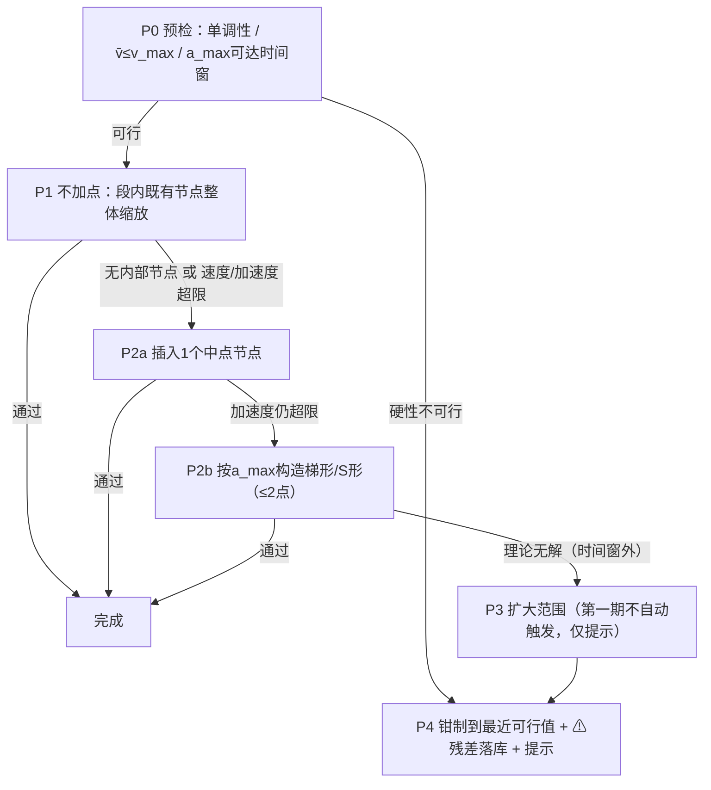

# 轨迹编辑增强方案：基于时间关键帧反推 Path + Speed Profile（设计探讨稿）

本文是 [Trajectory_Editing.md](Trajectory_Editing.md) 的增强功能规划：允许用户在**预览播放的时间轴上**直接拖动车辆（ghost marker）到期望位置，把这些"某时刻某车应该在某处"的**时间关键帧（keyframe）**要求，反向转化为对 `EntityPath` + `EntitySpeedProfile` 的修改，使最终插值出的轨迹尽量贴近用户设定的关键帧。

> **定位说明**：这是一个探讨稿而非定稿。"从关键帧反推 path + speed profile"在数学上是一个欠定/超定并存的反问题（inverse problem），不存在唯一"正确"解法。本文给出多个候选技术方案并充分讨论优缺点，交互设计也按"先可用、再精细"分层规划，最终选型建议在原型验证后再冻结。

> **范围更新（用户已定稿）**：拖拽轨迹车辆时 ghost **仅沿既有路径滑动**，算法**只修改 speed profile、完全不改 path 几何**；修改优先在**不新增 profile 点**的前提下做局部调整，只有当加减速超限或无法达成时，才允许插入新点、进而考虑扩大调整范围。第 2/3/5/7 节相应内容已按此收窄，第 4 节改为"级联式修改策略"并细化，待澄清事项集中在第 11 节。

---

## 1. 需求与问题形式化

### 1.1 现有轨迹的数学结构

按现有实现，一条 `EntityTrajectory` 的运动学完全由两部分决定：

- **几何**：路径曲线 $P(s)$，$s \in [0, L]$ 为弧长，由稀疏控制点 + 插值模式（Linear/Catmull-Rom/Clothoid）定义（`EntityPath::Evaluate`，[StudioDataModel.cpp:2361](EnvironmentSimulator/Modules/StudioViewerBase/StudioDataModel.cpp#L2361)）。
- **时序**：距离-速度曲线 $v(s)$（分段线性，`EvaluateSpeed`，[StudioDataModel.cpp:2579](EnvironmentSimulator/Modules/StudioViewerBase/StudioDataModel.cpp#L2579)），通过数值积分

$$t(s) = \int_0^s \frac{ds'}{v(s')}$$

  得到到达时刻（`EvaluateTimeAtS`，[StudioDataModel.cpp:2612](EnvironmentSimulator/Modules/StudioViewerBase/StudioDataModel.cpp#L2612)），再经二分反查 $s(t)$（`EvaluateSAtTime`，[StudioDataModel.cpp:2639](EnvironmentSimulator/Modules/StudioViewerBase/StudioDataModel.cpp#L2639)）。

ghost marker 在 $t$ 时刻的位置就是复合函数（[TrajectoryRenderer.cpp:236-249](EnvironmentSimulator/Modules/StudioViewerBase/TrajectoryRenderer.cpp#L236-L249)）：

$$T(t) = P(s(t))$$

### 1.2 用户输入：时间关键帧

用户在时间轴上把 `virtual_time_` 拖到 $t_k$，看到车辆位于 $T(t_k)$，然后把它拖到新位置 $q_k$。这构成一组约束：

$$T(t_k) = P(s(t_k)) \approx q_k, \quad k = 1..K$$

要求：设计一个算法，修改 $P$（控制点）与 $v(s)$（速度节点），使上述约束尽量满足；同时修改应尽可能**局部**、**可解释**、**保留用户此前手工编辑的成果**。

### 1.3 为什么这是一个 open question

1. **欠定**：单个关键帧只约束 2 个标量（$q_k$ 的 x/y），而可动参数（全部控制点 + 全部速度节点）远多于此——满足约束的修改方式有无穷多种，需要额外准则（最小改动、局部性、平滑性）来挑一个"好"解。
2. **超定**：多个关键帧之间可能互相冲突（例如两个关键帧要求的平均速度超出上限、或要求车辆沿路径倒退），此时只能近似满足，需要定义"接近"的度量与取舍策略。
3. **耦合**：改路径几何会改变弧长 $L$ 与每个点的 $s$ 坐标，进而改变 $t(s)$ 积分——几何与时序两个子问题不是正交的，任何"先改一个再改另一个"的分解都需要迭代或允许残差。
4. **可解释性约束**：数学上最优的解（比如全局最小二乘）可能把用户精心摆好的路径整体挪动一点点，"处处都变了一点"恰恰是交互编辑中最糟糕的体验；工程上"局部、可预期"往往比"全局最优"更重要。

---

## 2. 关键观察：横向 / 纵向分解

把拖拽位移 $q_k - T(t_k)$ 投影到路径上（可直接复用 `FindNearestPositionOnPath`，[StudioDataModel.cpp:2390](EnvironmentSimulator/Modules/StudioViewerBase/StudioDataModel.cpp#L2390)），得到：

- **纵向分量**：$q_k$ 在路径上的投影点弧长 $s^*_k$ 与当前 $s(t_k)$ 之差——"车到这儿的时间早了/晚了"。**只需改 speed profile**，几何不动。
- **横向分量**：$q_k$ 到路径的垂直距离 $d_k$——"路根本不从这儿过"。**必须改 path 几何**。

**定稿决策**：本功能只保留纵向分量——拖拽时把鼠标位置连续投影到路径上，ghost 始终吸附在路径上滑动，横向分量在手势层就被丢弃。用户想改几何时，直接使用既有的路径控制点拖拽/右键增删点功能，两者职责清晰分离。因此：

| 用户手势 | 直觉语义 | 对应修改 |
|---|---|---|
| 拖动 ghost（自动吸附路径滑动） | "这个时刻它应该再往前/往后一点" | 只调 $v(s)$（提前/推迟到达） |
| ~~垂直路径方向拖动~~ | ~~"路应该往这边偏"~~ | 不支持——改几何请拖路径控制点（既有功能） |

这也消除了方案 A 原本需要的"横向变形后重投影迭代"环节：几何不动、弧长不变，每个关键帧的 $s^*_k$ 投影一次即固定。

---

## 3. 候选技术方案

### 方案 A：分解式局部求解（投影分解 + 两个独立子问题 + 少量迭代）

**思路**：对每个新增/修改的关键帧，先做第 2 节的横纵分解；横向分量用局部路径变形消掉（见第 5 节），纵向分量用局部速度节点求解消掉（见第 4 节）；因为改几何会微扰弧长，最后把所有关键帧重新投影、重新跑一遍纵向求解（实践中 1-2 轮迭代即可收敛，因为拖拽位移相对路径全长很小）。

| 优点 | 缺点 |
|---|---|
| 修改严格局部化：只动被拖关键帧附近的控制点/速度节点，其余部分零改动，符合交互编辑直觉 | 分解只是近似正交：横向变形后 $s^*_k$ 会漂移，需要重投影迭代；理论上无收敛保证（实践中位移小、基本一轮收敛） |
| 每个子问题都是一维、单调的小问题（二分即可），无求解器依赖、数值稳健、易调试 | 多关键帧强耦合（间隔很近、互相拉扯）时，逐个局部求解可能顾此失彼，只能达到次优 |
| 增量式：每放一个关键帧立即求解、立即可见，天然适合交互节奏 | 斜向拖拽的横纵分界（阈值）需要精心设计，边界附近行为可能让用户意外 |
| 失败模式清晰：哪个区段超速/倒退可以精确指认并在 UI 上标红 | 对"路径大改"型编辑（把整段路挪到另一条车道）无能为力——但这类编辑本来就该用已有的路径点拖拽完成 |

### 方案 B：全局优化（非线性最小二乘）

**思路**：把（受影响范围内的）路径控制点 $\theta$ 与速度节点 $\phi$ 全部当作变量，解

$$\min_{\theta,\phi}\; \sum_k \left\| P_\theta(s_\phi(t_k)) - q_k \right\|^2 + \lambda \left\|\theta - \theta_0\right\|^2 + \mu \left\|\phi - \phi_0\right\|^2 + (\text{平滑正则})$$

用 Gauss-Newton / Levenberg-Marquardt 或"几何/时序交替固定"的块坐标下降求解。

| 优点 | 缺点 |
|---|---|
| 多关键帧冲突时给出全局一致的折中解，而不是逐个覆盖 | 目标函数要对 $s_\phi(t)$（一个积分的反函数）求导，解析 Jacobian 复杂，数值差分又慢又抖 |
| "最小改动"由正则项显式表达，理论性质清楚 | 非凸：可能收敛到让用户意外的解（整条路径每个点都动一点），恰恰破坏局部性期望 |
| 天然可扩展：以后加"最大加速度"、"不越车道"等约束只是加项 | 需要引入优化库（Eigen/Ceres 之类，仓库目前没有）或手写 LM，工程成本高 |
| | 交互延迟不可控（迭代次数不定），difficult to debug（"为什么它把那个点挪了？"很难回答） |
| | 对单关键帧的日常场景是杀鸡用牛刀 |

### 方案 C：更换数据模型——直接时间关键帧化

**思路**：不做反推，把轨迹的权威表示改成动画软件式的 `(t, pose)` 关键帧序列 + 时间域插值；path + speed profile 退化为"生成初始关键帧的工具"或干脆废弃。

| 优点 | 缺点 |
|---|---|
| "编辑某时刻的位置"变成对权威数据的直接编辑，天然精确满足，零反推算法 | **与本需求的前提直接冲突**：用户明确要求转化为对 path + speed_profile 的修改，而不是换模型 |
| 动画行业成熟交互范式（时间轴 + 关键帧 + 缓动曲线），用户教育成本低 | 推翻已实现并已验证可用的 v1 数据模型、`.traj.json` schema、Trajectories Tab、渲染层的大部分成果 |
| | 速度变成位置的导数（隐式量），"把这段限速在 10m/s"之类的编辑反而变难；speed profile 图表失去权威性 |
| | 空间编辑体验退化：拖某个时刻的关键帧会同时改变几何与时序，"只想弯一下路、不想改时机"做不到了 |

结论：**不作为主方案**，但其"关键帧列表 + 时间轴"的交互外壳值得吸收（见第 7 节）；若未来用户强烈要求"关键帧必须严格精确命中"，可再评估 C 的混合形态。

### 方案 D：非破坏修正层（keyframe overlay + 显式烘焙）

**思路**：base 的 path + speed profile 不动；关键帧作为独立的约束列表存储；渲染 ghost 时在 $s(t)$ 之上叠加一个平滑的修正项 $\Delta s(t)$（过各 $(t_k, s^*_k - s(t_k))$ 的光滑插值），横向同理叠加偏移曲线。用户满意后点一个 `Bake` 按钮，用方案 A/B 把累计的修正真正写入 path + speed profile 并清空修正层。

| 优点 | 缺点 |
|---|---|
| 编辑期间关键帧**精确**满足（修正层就是按约束构造的），预览即所得 | 编辑期间存在两份真相（base + 修正层），渲染、保存、导出的每条路径都要记得叠加，一处遗漏就是诡异 bug |
| 非破坏：删除某个关键帧即撤销其影响，天然细粒度 undo | 不烘焙就保存时，`.traj.json` 里的 path+speed profile 单独拿出来**不能**复现用户看到的轨迹——数据一致性风险高 |
| 把困难的反问题推迟到显式 Bake 一步，且允许用户在 Bake 前反复调整 | Bake 最终还是要实现方案 A 或 B，总工作量是"A/B + 修正层"，只多不少 |
| | schema、渲染层、undo 的复杂度都显著增加 |

### 方案对比总结

| 维度 | A 分解式局部 | B 全局优化 | C 换模型 | D 修正层+烘焙 |
|---|---|---|---|---|
| 实现复杂度 | 低-中 | 高 | 高（推翻重来） | 中-高 |
| 关键帧满足精度 | 好（可行时精确，冲突时有残差且可指认） | 好（全局折中） | 精确 | 编辑期精确、烘焙后同 A/B |
| 修改局部性/可解释性 | **最好** | 差-中 | 不适用 | 好 |
| 交互实时性 | **最好**（微秒级 1D 二分） | 不确定 | 好 | 好 |
| 与现有架构契合 | **最好**（纯增量） | 中 | 最差 | 中 |
| 多关键帧强冲突处理 | 次优（顺序局部） | **最好** | 不适用 | 取决于烘焙算法 |

**推荐**：以**方案 A 为主线**落地；方案 B 作为后续"Refine All"批量精修按钮的候选（仅当实际使用中确实频繁出现多关键帧强冲突时再引入）；方案 D 的"关键帧约束持久化"部分单独吸收（见第 8 节——即使算法是破坏性的 A，仍然把用户的关键帧意图存下来，供重投影、重求解与跨会话展示）。

**范围收窄后的落地形态**：按定稿决策，本期只实现方案 A 的纵向半边——级联式 speed profile 修改（第 4 节）；横向半边（第 5 节）整体裁剪出本期范围。几何不动意味着弧长不变、关键帧投影一次即固定，方案 A 原本需要的迭代重投影环节随之消失，实现进一步简化。

---

## 4. 纵向求解：级联式修改策略（按定稿要求细化）

**总原则**：把"改动代价"排成一个级联，从最小侵入开始逐级降级——**先不加点、只调既有节点；不行才加点；再不行才考虑扩大范围；最后钳制兜底**。每一级求解后都做速度界 + 加速度检查，通过即停。所有级别都遵守：$s_a$ 之前（更早关键帧已锁定的部分）零改动；$s_b$ 之后的到达时刻平移由后续段的链式重解吸收（见 4.6）。

记当前段为 $[s_a, s_b]$（$s_a$ = 上一个关键帧的投影弧长或 0，$s_b = s^*_k$），要求段通过时间 $\Delta t = t_k - t_a$，段长 $L_{ab} = s_b - s_a$，所需平均速度 $\bar v = L_{ab}/\Delta t$。基础数学事实：$t(s_b)$ 对段内任一节点速度的上调严格单调递减，因此每一级里的求解都是一维单调求根，二分即可；分段线性 $v(s)$ 上加速度 $a = v \cdot dv/ds$ 在每个线性分段内单调，分段最大值为 $|m| \cdot \max(v_{start}, v_{end})$（$m$ 为该段斜率 $dv/ds$），加速度检查有闭式表达。



### 4.1 P0 预检（不改任何东西就能判定的硬性不可行）

1. **时序单调**：$t_k$ 大于上一关键帧时刻、$s^*_k > s_a$（拖动交互本身已在手势层挡住倒退，见 7.2）；
2. **速度硬上限**：$\bar v \le v_{max}$；
3. **加速度可达性粗检**：从边界速度出发、全程按 $\pm a_{max}$ 变速所能实现的通过时间窗 $[\Delta t_{min}, \Delta t_{max}]$ 若不含 $\Delta t$，段内无论怎么改都无解（"慢"的一侧因 `MIN_SPEED` 钳制（[StudioDataModel.cpp:2628](EnvironmentSimulator/Modules/StudioViewerBase/StudioDataModel.cpp#L2628)）近乎不设限，通常只有"快"的一侧会卡住）。

任一不满足 → 直接进入 P4 钳制兜底，跳过所有中间尝试。

### 4.2 P1 不加点：段内既有节点整体缩放（首选）

自由变量 = 落在 $(s_a, s_b]$ 内的**既有**速度节点，速度统一乘系数 $\alpha$，对 $\alpha$ 二分。

- **保形**：段内节点的相对形状完整保留（先加速后减速的超车形状只被整体快放/慢放）——这正是"不加点、局部改"的最自然实现。
- **段外零改动的前提**是 $v(s_a)$ 被节点锚住（上一关键帧求解时插入的边界节点，或 $s_a=0$ 处天然存在的起点锚点）。缩放后受影响的曲线范围截止于最后一个被缩放节点右侧的第一个段外节点，右侧溢出的到达时刻变化由链式重解吸收。
- **无内部节点时**（最常见的初始状态：profile 只有首尾两个锚点）P1 没有自由变量，直接进入 P2。是否允许把 $v(0)$（初始速度）也作为自由变量参与，见澄清问题 2。
- 求解后检查：缩放后所有节点速度在 $[v_{min}, v_{max}]$ 内；每个受影响线性分段的 $|m| \cdot \max(v) \le a_{max}$。任一超限 → P2。

### 4.3 P2 加点：局部重塑（次选）

**P2a 插入 1 个中点节点**：若 $s_a$、$s_b$ 处尚无节点，先按当前插值值插入边界锚点（保证段外不受影响），再在段中点插入自由节点 $v_m$，二分求解。求解后同样做速度/加速度检查，超限 → P2b。适用前提是段内**原本没有**内部节点（最常见场景）；若 P1 是"有内部节点但缩放超限"而失败，再叠加一个中点自由度通常压不住加速度，直接跳到 P2b。

**P2b 梯形 / S 形构造（加速度受限的经典解）**：以 $a_{max}$ 为斜率上限，从 $v(s_a)$ 变速到平台速度 $v_p$、平台保持、末端衔接回 $s_b$ 处的锚点速度，插入至多 2 个节点（段内原有节点被替换——这是级联中唯一会重排段内既有节点的层级，且仅在这些节点的形状已被 P1 证明无法满足约束后才走到）；$v_p$ 由通过时间方程解析可解（或统一用 1D 二分）。需要提前到达时 $v_p$ 高于两端（梯形），需要推迟时低于两端（倒梯形/山谷），同一套方程带符号处理。这是加速度约束下"物理上最平滑的段内解"；P2b 仍无解说明 $\Delta t$ 落在 P0 粗检的可达时间窗之外（正常流程不会走到，作为断言兜底）。

### 4.4 P3 扩大修改范围（保留能力，第一期不自动触发）

P1/P2 的前提是只动 $[s_a, s_b]$ 段内。当段内可达时间窗不含 $\Delta t$（典型场景：上一关键帧刚过、剩余距离太短，物理上冲不到所需平均速度）时，正确做法是**更早开始加/减速**——把修改窗口向前扩展越过 $s_a$，这必然牵动上一关键帧的约束，需要两段联立重解或放宽前序约束。第一期建议：**不自动扩窗**，判定无解时直接走 P4，并明确提示原因（如"受上一关键帧 t=10.0s 限制，最早只能 t=12.6s 到达"），把是否放宽前序关键帧的决定权留给用户（见澄清问题 4）。

### 4.5 P4 兜底：钳制 + 残差落库

把 $t_k$ 钳制到当前级联能达到的最近可行值，按钳制后的值完成修改；关键帧落库为 ⚠ 状态（同时记录用户原始期望值与实际达成值），UI 与 Log 提示原因。继承 16.2 节"不能没反应"的教训：宁可"做到最接近 + 醒目提示"，不做静默拒绝（是否维持此默认见澄清问题 8）。

### 4.6 链式重解、末端语义与被放弃的"全表重构"

- **链式重解**：本段修改会平移 $s_b$ 之后所有位置的到达时刻。后面还有关键帧时，从下一段开始按同一级联依次重解（前面的段不受影响，天然增量）；没有时，总时长自然变化，不试图锁定总时长（见澄清问题 10）。
- **末端外推**：$t_k$ 晚于走完全程的总时间且拖到路径终点附近时，语义是"到终点后停住等待"而非可满足的段约束，原型阶段先拒绝（拖动手势层面直接挡在终点）。
- **全局单调样条重构**（对全部 $(t_k, s^*_k)$ 拟合单调样条、整张 profile 重建）与"最小侵入"原则冲突——节点数量/位置全变、用户手工编辑成果尽毁，级联中不使用；仅保留为将来可能的显式"按关键帧重建全表"按钮候选。

---

## 5. 横向子问题：路径几何的局部变形

> **本节已整体裁剪出本期范围**（定稿决策：拖拽 ghost 不改 path 几何，改几何一律走既有的路径控制点编辑）。以下内容保留作为未来若重新引入横向编辑时的设计参考，不参与本期实现与评审。

**问题**：让路径从 $q_k$（或其附近）经过，且只在局部范围内变形。

### 5.1 候选变形策略

| 策略 | 做法 | 优点 | 缺点 |
|---|---|---|---|
| a. 移动最近控制点 | 找到 $s^*_k$ 最近的控制点，直接平移 $d_k$ 的横向分量 | 最简单；控制点数不变 | 控制点离 $s^*_k$ 远时，曲线在 $s^*_k$ 处的实际位移明显小于拖拽量（插值稀释），需要迭代放大；也可能牵动较远的曲线段 |
| b. 在 $s^*_k$ 处插入新控制点 | `InsertPoint(s^*_k, q_k)`（现成 API） | 曲线精确过 $q_k$（Linear/Catmull-Rom 下）；语义直白 | 反复编辑会累积出密集控制点；点太密后拖拽体验退化 |
| c. 带衰减的比例编辑（proportional edit） | 以 $s^*_k$ 为中心、半径 $r$ 内的控制点按高斯/余弦权重分摊位移 | 变形平滑自然，类似 Blender 比例编辑 | 多一个"半径"参数要暴露/调优；影响范围内用户手工摆好的点也会被挪动 |
| 推荐组合 | **就近阈值内用 a（并迭代 1-2 次修正插值稀释），阈值外用 b**；c 作为后续可选增强 | 平衡精确性、稀疏性与实现成本 | |

### 5.2 几何变形后的连锁更新

路径几何一旦变化：

1. 弧长表变化 → `SyncSpeedProfileEndpoints()` 维持首尾锚点（[StudioDataModel.hpp:196](EnvironmentSimulator/Modules/StudioViewerBase/StudioDataModel.hpp#L196)）；
2. 所有关键帧重新投影得到新的 $s^*_k$；
3. 受影响区段重跑第 4 节纵向求解；
4. `MarkDirty(entity)` 触发重绘。

这一串就是方案 A 的"迭代"内容，代码上是一个 3-4 步的固定顺序刷新函数，不是开放式循环。

---

## 6. 多关键帧的管理语义

- **归属**：关键帧属于某个 entity（`map<entity_name, vector<Keyframe>>`），一个 entity 可有多个关键帧，按 $t$ 排序存储。
- **修改已有关键帧**：时间轴移到已有关键帧的 $t_k$ 附近（吸附），再拖 ghost 即为更新该关键帧；也可在关键帧列表里直接改 $t$ 或删除。
- **重求解顺序**：任何一个关键帧增/删/改后，从受影响的最早段开始向后逐段重解（前面的段不受影响，天然增量）。
- **冲突取舍**：顺序求解意味着"靠前的关键帧优先被精确满足，靠后的在可行域内尽量满足"。这是一个明确、可解释的规则；若未来要"全体折中"，才需要方案 B。

---

## 7. 交互设计

### 7.1 编辑场所：先在 COMPOSER 内做"可拖时间轴 + ghost 关键帧编辑"，暂不进 VIEWER

现状约束：

- 时间轴 slider 在 COMPOSER 模式下是禁用的（[StudioGui.cpp:2709](EnvironmentSimulator/Modules/StudioViewerBase/StudioGui.cpp#L2709) `RenderTimeline()` 内对 COMPOSER `BeginDisabled`），VIEWER 模式下由 `ScenarioPlayer` 驱动前进；
- 所有既有编辑交互（鼠标世界坐标、拖拽状态机、右键菜单、`wantCaptureMouse` 门控）都只在 COMPOSER 下开放；VIEWER 模式的输入被 `ScenarioPlayer` 的事件循环共享，且该模式定位是"只读预览"（[Trajectory_Editing.md](Trajectory_Editing.md) 7.2 节表格）。

**决策建议**：第一期把"预览 + 关键帧编辑"放在 **COMPOSER** 内完成——解禁 COMPOSER 下的时间轴 slider（拖动它只驱动 ghost 动画，与 xosc 场景无关，`virtual_time_` 本来就是 ghost 的驱动量），用户拖时间轴 scrub 到任意时刻，ghost 停在 $T(t)$，再拖 ghost 即建关键帧。这样：

- 完全复用现有交互基建（命中测试、增量拖拽、右键菜单、undo 挂接点），改动面小；
- 避免与 `ScenarioPlayer` 抢输入、抢模式语义的高风险改造；
- "预览模式下编辑"的字面需求，本质是"在时间维度上编辑"，在 COMPOSER 里给时间轴 + ghost 即可满足；真正的 VIEWER 模式内编辑（边播放边拖车）留作后续评估（需要先解决暂停语义、输入路由、以及编辑后 xosc 场景是否需要重启播放等一整层问题）。

### 7.2 手势设计

| 手势 | 行为 |
|---|---|
| 拖动时间轴 slider（COMPOSER 内解禁） | ghost 沿轨迹 scrub；接近已有关键帧 $t_k$ 时轻微吸附并高亮该关键帧 |
| 左键按住 ghost 拖动 | ghost **始终吸附在路径上滑动**（鼠标位置连续投影到路径取 $s$），按下即记录 $t$，松开时以当前投影弧长 $s^*$ 生成/更新关键帧并触发第 4 节级联求解。**不改路径几何**——想改几何请直接拖路径控制点（既有功能），无需修饰键区分模式 |
| 拖动越过相邻关键帧的投影位置 | 硬性挡住：ghost 停在边界稍内侧并变红提示（避免时序倒退/穿越），见澄清问题 7 |
| 右键 ghost / 右键关键帧菱形标记 | 弹出菜单：`Delete Keyframe`、`Re-solve`——沿用第 16.3 节确立的"单击右键菜单而非双击"经验 |
| Esc（拖动中） | 取消本次拖拽，ghost 弹回，未落库 |

### 7.3 拖动中的实时反馈（关键：让"能不能满足"在松手前就可见）

拖动过程中每帧廉价地跑一遍可行性检查（只需算所在段的 $\bar v$ 与级联首层的粗判，均为闭式计算），实时显示：

- ghost 沿路径滑动，原位置到当前位置之间的路径段高亮（滑过的距离可视化）；
- ghost 旁浮动 tooltip：`t=12.40s  s: 84.2→91.5m  平均速度 14.2 m/s ✓ [P1 缩放2个节点]`——末项是**级联层级预告**，在松手前就告知将发生什么（"不加点缩放"/"将插入1个节点"/"将按a_max构造梯形"/"将钳制到 t=13.1s"），把第 4 节的分级决策透明化；
- speed profile 图表联动：受影响段实时预览新的速度形状（半透明叠加），速度/加速度超限段红色；
- 拖到相邻关键帧投影位置的边界时 ghost 变红并停住（见 7.2）。

### 7.4 关键帧的可视化与列表

- **3D 视图**：每个关键帧在路径上的投影点画菱形标记（区别于圆形路径控制点），旁标 `t=12.4s`；选中的关键帧高亮。
- **Trajectories Tab**：每个 entity 的条目下新增 `Keyframes` 小节——表格列出 $t_k$ / 目标位置 / 状态（✓ 满足、⚠ 有残差 + 残差值、✗ 冲突），行内 `Delete` 按钮与 `Go`（把时间轴跳到 $t_k$）按钮；行高亮联动 3D 选中，复用 speed profile 表格行高亮的既有做法。
- **speed profile 图表**：在 $s^*_k$ 处画竖直参考线 + 顶部时间标签，让"这个速度形状是被哪个关键帧锚住的"一目了然。

### 7.5 失败与撤销

- 不可行拖拽默认**钳制到最近可行 + 显示实际达成值 + Log 一条原因**，而不是静默拒绝（拒绝会让用户以为拖拽又"没反应"——16.2 节的教训）；Esc/右键 Delete Keyframe/未来的 Ctrl+Z（M8）三条退路。
- 每次关键帧落库 = 一次撤销单元（挂到 [Trajectory_Editing.md](Trajectory_Editing.md) 11.5 节的提交粒度表中，新增一行）。

---

## 8. 持久化：`.traj.json` schema v2

即使算法（方案 A）是破坏性地改写 path + speed profile，仍建议把**用户的关键帧意图**一并存档：

```jsonc
{
  "version": 2,
  "entities": {
    "GhostCar1": {
      "path":          { /* 同 v1 */ },
      "speed_profile": { /* 同 v1 */ },
      "keyframes": [                       // 新增，可选字段；v1 文件无此字段按空处理（向后兼容）
        { "t": 12.400, "x": 105.230, "y": -3.100, "s": 91.500 },   // x/y: 吸附滑动落点的世界坐标（供路径几何变动后重投影）；s: 当时的投影弧长缓存
        { "t": 20.000, "x": 180.500, "y": 2.250,  "s": 163.024 }
      ]
    }
  }
}
```

理由：

1. 路径/速度后续被手工再编辑后，可以用存档的关键帧一键 `Re-solve`（重投影 + 重求解），恢复时间约束；
2. 跨会话保留 3D 视图/列表里的关键帧标记，用户能看到"当初为什么这段速度长这样"；
3. 为将来可能的方案 B（全局精修）保留完整输入。

`LoadTrajJson`/`SaveTrajJson`（[StudioDataModel.cpp:2753](EnvironmentSimulator/Modules/StudioViewerBase/StudioDataModel.cpp#L2753)、[L2689](EnvironmentSimulator/Modules/StudioViewerBase/StudioDataModel.cpp#L2689)）按可选字段扩展，读不到 `keyframes` 时视为空数组，v1 文件完全兼容。

---

## 9. 与现有实现的集成点

| 层 | 改动 |
|---|---|
| `StudioDataModel.hpp/.cpp` | 新增 `TrajectoryKeyframe { double t; double x, y; double s; }` 与 `EntityTrajectory::keyframes_`；新增纵向级联求解器（第 4 节 P0-P4，纯函数：输入段边界+目标时长+限值，输出节点修改方案）；`LoadTrajJson`/`SaveTrajJson` 扩展 v2 字段 |
| `StudioGui.hpp/.cpp` | COMPOSER 下解禁时间轴（[StudioGui.cpp:2709](EnvironmentSimulator/Modules/StudioViewerBase/StudioGui.cpp#L2709) `RenderTimeline()` 去掉 COMPOSER 的 `BeginDisabled`，语义改为"ghost 预览时间"）；ghost 命中测试 + 拖拽状态机（结构完全平行于既有 `trajectory_point_drag_active_` 一族，增量拖拽、`UpdateMousePositionFromWorld()`、DRAG 事件刷新等 16.2 节教训全部适用）；右键菜单扩展；Trajectories Tab 增加 Keyframes 小节；拖动中实时反馈绘制 |
| `TrajectoryRenderer.hpp/.cpp` | 关键帧菱形标记 + 时间标签渲染；拖动预览（滑过的路径段高亮）；ghost 命中所需的"当前 ghost 位置"查询接口（现在 ghost 位置只在 `RebuildEntityGroup` 内部临时算出，[TrajectoryRenderer.cpp:236-249](EnvironmentSimulator/Modules/StudioViewerBase/TrajectoryRenderer.cpp#L236-L249)，需要暴露/缓存给命中测试用） |
| 交互状态机 | 新增 `ghost_keyframe_drag_active_` 一族状态，与连续点选/路径点拖拽/heading 编辑互斥，纳入既有互斥约定（Trajectory_Editing.md 6.2 节） |

---

## 10. 分阶段路线图（建议）

1. **E1 纵向 MVP**（价值最高、风险最低）：COMPOSER 解禁时间轴 scrub；ghost 沿路径吸附拖动（连续投影取 $s$）；级联 P0 预检 + P1 不加点缩放 + P4 钳制兜底（暂缺 P2 时，P1 失败直接钳制并提示）；关键帧内存态管理 + 3D 菱形标记；不落盘。
2. **E2 级联补全**：P2a 中点插点、P2b 梯形/S 形构造、加速度检查全量接入；拖动中的级联层级预告 tooltip；speed 图表半透明预览。
3. **E3 持久化与列表**：schema v2、Keyframes 表格/状态列、Go/Delete/Re-solve、speed 图表 $s^*_k$ 参考线联动、路径几何变动后的 stale 标记。
4. **E4 精修与增强（按需）**：P3 扩窗联立重解；方案 B 的 `Refine All` 全局精修按钮；VIEWER 模式内编辑的可行性再评估。

每阶段末尾照例：构建验证 + 手工测试 + 提交 + 更新本文档状态。

---

## 11. 待澄清问题（按定稿范围更新）

范围收窄后，原有的横纵分解阈值、Shift/Ctrl 模式修饰键、`mode` 持久属性等问题已随之消失；以下是实现前需要对齐的问题清单（按影响面排序）：

1. **加速度上限 $a_{max}$ 的取值与来源**：级联中"加减速过大"的判定标准。建议先用全局可配置常量（如舒适值 2.5 m/s²）；加速与减速是否用同一限值（实际车辆减速上限通常更大，如加速 +3、减速 -6 m/s²）？是否需要按车型区分（第一期建议不区分）？
2. **初始速度 $v(0)$ 是否允许被算法调整**：最简 profile（只有首尾两个锚点）在 P1 层没有任何内部节点可调；若 $v(0)$ 视为受保护值（用户在 Add Trajectory 里明确设置的），P1 将常态跳过、直接进入 P2 插点；若允许调整，很多简单场景可以做到零加点。建议：默认受保护，提供"允许调整初始速度"选项。
3. **P2 内部顺序确认**：先试 P2a（插 1 个中点，改动最小但形状是尖折点）、失败再 P2b（按 $a_{max}$ 梯形构造，至多 2 点、形状始终物理合理）——还是跳过 P2a、加点时一律用梯形构造（可能多 1 个点，但省去一次可能失败的尝试且形状更可预期）？
4. **P3 扩窗的触发方式**：段内物理无解（受上一关键帧钳制、距离太短）时，(a) 第一期直接钳制 + 提示"受上一关键帧限制"（本文建议），还是 (b) 自动向前扩窗、联立重解？(b) 更"聪明"但行为更不可预期。
5. **路径几何后续变动与关键帧的联动**：关键帧存 $(t, x, y)$ + 投影弧长 $s$ 缓存；用户之后手动拖路径控制点/增删点导致弧长变化时，已有关键帧 (a) 标记 stale、等用户点 `Re-solve`（本文建议），还是 (b) 自动重投影 + 重解？
6. **加速度检查的范围**：只检查本次级联修改波及的分段（本文建议），还是顺带全表扫描、把用户手工编辑造成的既有超限段也标出来（可做成仅警告显示、不拦截）？
7. **拖动越过相邻关键帧投影位置的行为**：硬性挡住（ghost 停在边界稍内侧，本文建议）还是允许越过并自动删除/合并被越过的关键帧？
8. **不可行时的兜底语义**：钳制到最近可行值 + ⚠ 残差落库（本文建议，理由是 16.2 节"没反应"教训）还是拒绝弹回？
9. **速度硬上限 $v_{max}$**：沿用图表上限 25 m/s 作为硬约束是否可接受？
10. **总时长**：最后一个关键帧之后的段保持原速度形状、总时长自然变化（本文建议），还是需要"锁定总时长"选项？
11. **关键帧时刻 $t$ 是否可在列表中直接编辑**（第 6 节提到的能力）：改 $t$ 第一期按"删除+新建"处理（本文建议），还是需要专门的平滑迁移逻辑？
